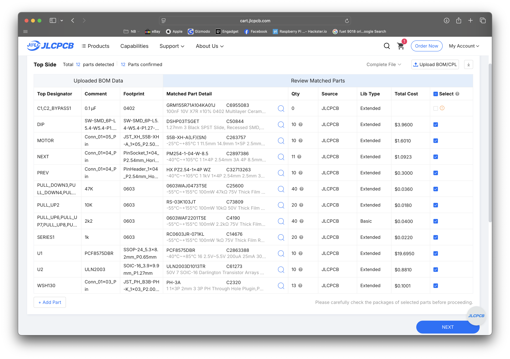
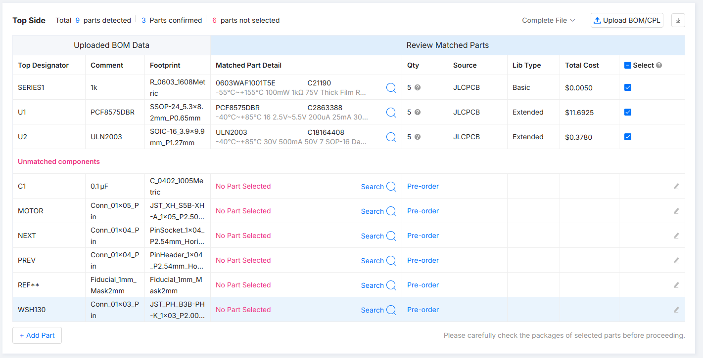
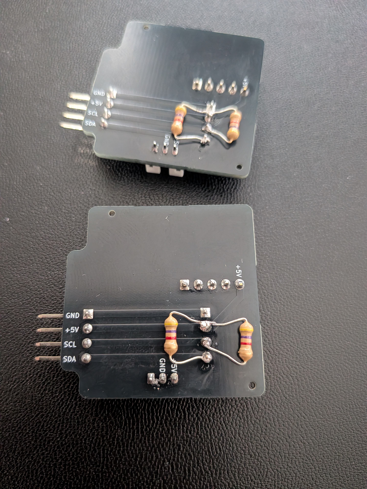

# Ordering the SplitFlap PCB v5.1 from JLCPCB

Step-by-step instructions for ordering **dowjames's SplitFlap PCB v5.1** from [JLCPCB](https://jlcpcb.com/), with full SMT assembly. Compiled from community experience in the Split Flap Display Discord.

---

## What You're Ordering

Each PCB is a per-module I²C-controlled stepper driver board. You need **one PCB per split-flap module** (i.e., per letter/character). Most people order **10 PCBs** at a time (JLCPCB's minimum for assembly).

The boards connect to each other via 4-pin headers (NEXT/PREV), daisy-chaining power (+5V/GND) and data (SCL/SDA) between modules — no wiring between boards.

---

## Files You Need

Download **`splitflapv5.1-pcb.zip`** from the [`custom-pcb/dowjames-v5.1/`](custom-pcb/dowjames-v5.1/) folder of this repository and unzip it. Inside you'll find a `splitflapv5.1-pcb/` folder containing these three files:

| File | Purpose |
|------|---------|
| `gerber.zip` | Gerber + drill files (upload as the PCB manufacturing file) |
| `bom.csv` | Bill of materials with LCSC part numbers |
| `positions.csv` | Pick-and-place / CPL file for component positioning |

---

## Step-by-Step Ordering Process

### Step 1: Upload Gerbers

> **Log in to your JLCPCB account before uploading.** If you upload the gerber while logged out, the site might not auto-populate the PCB dimensions from the file — you'll be left with blank X/Y fields. Log in first to avoid this.

1. Unzip **`splitflapv5.1-pcb.zip`** — the three files you need are inside the `splitflapv5.1-pcb/` folder
2. Go to [https://cart.jlcpcb.com/quote](https://cart.jlcpcb.com/quote)
3. Click **"Add gerber file"** and upload **`gerber.zip`** from that folder
4. JLCPCB will parse the files and show a preview of the PCB

### Step 2: Configure PCB Options

On the first page, set the following:

| Setting | Value |
|---------|-------|
| **Quantity** | 10 (minimum for assembly, and a good number for a display) |
| **PCB Color** | Your choice (black and green are popular in the community) |
| **PCB Thickness** | **1.6mm** (default — don't change this) |
| **Surface Finish** | Default (HASL) is fine |

Leave everything else at defaults unless you have a specific reason to change it.

### Step 3: Enable PCB Assembly

Still on the first page:

1. Scroll down and toggle **"PCB Assembly"** to ON
2. Select **"Assemble top side"**
3. Set assembly quantity to match your PCB quantity
4. Click **"Confirm"** or **"Next"** to proceed

### Step 4: Upload BOM and Positions Files

On the assembly page:

1. Click **"Upload BOM/CPL"**
2. Upload **`bom.csv`** as the BOM file
3. Upload **`positions.csv`** as the CPL (component placement) file
4. Click **"Process BOM & CPL"**

### Step 5: Review Matched Parts

JLCPCB will show you matched components. If everything went correctly, you should see **12 parts detected, 12 parts confirmed**:

> **Common mistake:** If you see only 3 parts matched and many "Unmatched components" (like the screenshot below), you uploaded the wrong files. Make sure you're using `bom.csv` and `positions.csv` from inside the `splitflapv5.1-pcb/` folder within the zip — not any other folder or file.
>
> 

**Make sure all parts are selected (checkboxes ticked).** The two bypass **capacitors** — `C1` and `C2_BYPASS1` — may show quantity 0 and be unselected by default. **Select them.** (Despite the `BYPASS` name they're capacitors, not resistors — this has tripped people up.)

### Step 6: Review Component Placement — Rotate If Needed

On the placement review page, JLCPCB shows a 3D render of component positions. **Some components may appear rotated incorrectly in the visualizer.**

This is a known issue. Community members confirmed you typically need to **rotate 2–3 components** to match the correct orientation:

- Look at each component and compare to the PCB silkscreen
- If a component looks rotated (e.g., a connector appearing sideways), click on it and use the **Rotate** button
- The WSH130 hall sensor connector may overlap with adjacent areas if not rotated — fix this
- **The DIP switch will look "upside-down" in the visualizer — this is intentional.** dowjames mounted it that way so the `1, 2, 3` labels read correctly when installed. Don't try to "fix" the DIP switch orientation.

> *"I think they get confused because I mounted the dip switches upside down.. but because they're labelled 1,2,3 it would look stupid if they were mounted the other way round"* — dowjames

> *"you just hit rotate on those 2 components"* — norpan
>
> *"i had to rotate it"* — ducky626
>
> *"The JLC visualiser always rotates components ... I think its down to those components having wrong rotation set in the library"* — foxmanj / norpan

### Step 7: Review Pricing and Checkout

Before completing the order:

1. Review the order summary
2. **Check the shipping method** — JLCPCB defaults to the fastest (most expensive) shipping option. Scroll through the shipping options and pick a more economical one if you're not in a rush.
3. **Check the [JLCPCB coupons page](https://jlcpcb.com/coupons)** for available discounts before placing your order.

**Price reference** (as of Nov 2025, 10 assembled PCBs shipped to Germany):

> *"make sure to change the shipping in the last step, their idea of shipping PCB is to choose the fastest option, which costs usually the most"* — norpan
>
> *"DHL shipping is fast!"* — drewferg11
>
> *"Go to their coupons page"* — foxmanj

---

## After You Order: JLCPCB Confirmation Emails

JLCPCB may email you **within a few hours** of placing your order with questions about component placement. This is normal — they manually review SMT orders. Here's what to expect:

### "Are the polarities and placements correct?"

You will likely receive an email like:

> *"Since we are not so sure about the polarities of the DIP components are correct or not. Could you please kindly check if the polarities and placements of the components are correct in the attached picture?"*

They will attach an image like this:

**Reply: Yes, the placement and polarities are correct.** This has been confirmed by dowjames and multiple community members.

### "Do you want the header pins at a right angle?"

JLCPCB may ask to confirm you want the NEXT/PREV header pins mounted at a right angle (horizontal). **Reply: Yes, that is correct.** The horizontal headers are how the boards daisy-chain together.

---

## After the Boards Arrive: What You Still Need to Do

The assembled PCBs arrive with all SMT components soldered. However, there are a few things that are **NOT included** in the JLCPCB assembly that you must handle yourself:

> ⚠️ **Power on the board without firmware loaded and the motors will overheat.** These boards use a **PCF8575 I/O expander** (U1 on the custom PCB) which pulls all output pins HIGH by default. With a motor connected and no firmware running, both motor coils are energized continuously — the motor and ULN2003 driver get hot enough to warp flaps and burn fingers (jhoff0804 measured ~130°F / 54°C; drewferg11 had a drum deform badly enough to require replacement). **Have your firmware ready to flash before connecting motors**, or at minimum disconnect the motor connector until the ESP32 is running real code.
>
> *"The I/O expander pulls all pins high by default, which energizes both coils on the motors and causes them to get hot before uploading working firmware. I was reminded of this when I took my module apart and about burnt my fingers. I measured the plastic housing at about 130⁰ F"* — jhoff0804

### 1. Add I²C Pull-Up Resistors (Required)

You **must** add **4.7kΩ pull-up resistors** on the I²C SDA and SCL lines, or the display **will not work**.

- You only need to add them on **one board** (typically the first module in the chain, closest to the ESP32)
- Solder a 4.7kΩ resistor from SDA to +5V, and another from SCL to +5V
- Through-hole resistors work fine; the back of the first PCB is a popular spot, but front works too — what matters is that SDA and SCL each get pulled up to +5V

> *"Also don't forget to put pull-up resistors on the i2c bus or it won't work"* — dowjames
>
> *"I soldered resistors to the back of the first pcb"* — dowjames
>
> *"You only need to put them on one board"* — dowjames
>
> *"yeah, you need at least 4.7k ohms"* — dowjames

### 2. Set DIP Switch Addresses

Each board needs a **unique I²C address** set via the onboard DIP switch. The PCF8575 has address pins A0/A1/A2 — set a different combination for each module (supports up to 8 unique addresses).

### 3. Connect Power Supply

Use a **5V power supply rated for at least 5A** for a full 8-module setup. The community recommends:

- **Raspberry Pi 5 official power supply** (5.1V, 5A USB-C) — this is what dowjames uses
- A Raspberry Pi 4 power supply (5V, 3A) may **not** be sufficient for multiple modules

**Power the boards directly from the 5V supply — don't power the chain through the ESP32's USB port** if you're using a small ESP32 variant (ESP32-C3, ESP32-S3, etc.). The on-board USB regulator and trace widths on those dev boards aren't sized for the current the motors draw, and the wires can get hot. dowjames runs power directly to the first board's NEXT header for this reason.

> A larger ESP32 dev board like the **ESP32-WROOM DevKit V1** can handle USB power for testing in a pinch — drewferg11 has done this successfully — but direct power to the PCB chain is still the recommended setup, especially for a full 8-module build.

> *"I used the power supply from a pi5. I believe it's rated for 5a"* — dowjames
>
> *"Didn't want to power it through the esp32 because the wires would get hot"* — dowjames
>
> *drewferg11 reported issues with a 3A Pi 4 supply; the boards "don't seem to like it"*

### 4. Connect ESP32

The ESP32 connects to the first board's NEXT header pins (+5V, GND, SCL, SDA). The ESP32's I²C pins drive the entire chain through the daisy-connected headers.

---

## Quick Reference

| Item | Value |
|------|-------|
| **Gerber file** | `gerber.zip` |
| **BOM file** | `bom.csv` |
| **CPL file** | `positions.csv` |
| **PCB quantity** | 10 (minimum for assembly) |
| **PCB thickness** | 1.6mm |
| **Assembly side** | Top |
| **Polarity email** | Reply "Yes, correct" |
| **Header pin email** | Reply "Yes, right angle is correct" |
| **Pull-up resistors** | 4.7kΩ on SDA and SCL (one board only) |
| **Power supply** | 5V, 5A (Raspberry Pi 5 PSU recommended) |

---

*Sources: Discord community members dowjames, norpan, foxmanj, drewferg11, ducky626, n1co_93 — Nov/Dec 2025*
