# Assembly

Note: most of the build steps from the [original guide](../../original/index.md) still apply, so these steps won't go into detail for items already documented there. If something is missing, please [open an issue](https://github.com/DrewFerg11/Split-Flap-Display/issues) and it'll get addressed.

I used a custom pcb module board for my setup, so these instructions will primarily focus on details specific to those boards, but this information is easily adaptable for the original diy boards.

## 1. Build Modules

Building each individual module is essentially the same as the original design. This includes:

- Installing the motor and hall sensor in the enclosure
- Assembling the drum with flaps and magnet
- Connecting the [DIY or custom PCB module board](../../../module-boards/index.md)

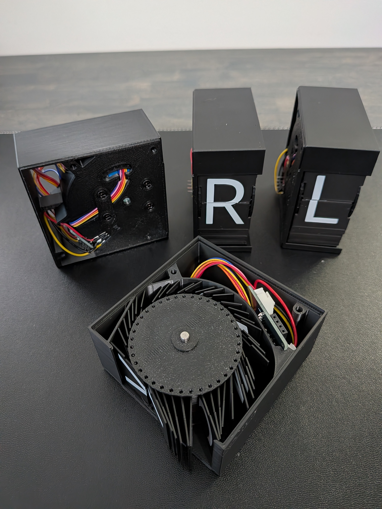{ width="500" .center }

## 2. Solder Module Wires

Regardless of the [module board](../../../module-boards/index.md) you're using, you'll want to solder wires of the correct length to the **first module board in each row** before connecting all modules together. I used **18 AWG** wire for 5V/GND and **24 AWG** wire for both I²C lines. Approximate wire lengths:

- Row 1 (top): 90mm
- Row 2 (bottom): 140mm

!!! tip "How I wired the first module"
    I used the [dowjames v5.1 custom PCB](../../../module-boards/custom-pcb/dowjames-v5.1/index.md) and soldered the wires directly to the PREV header pins, then added heat shrink tubing for protection. You'll also notice the [pull-up resistors](../../../i2c.md#pull-up-resistors) soldered on.

<div style="display: flex; gap: 1rem; margin: 1.5rem 0; flex-wrap: wrap;" markdown>
<figure style="flex: 1 1 200px; text-align: center; margin: 0;" markdown>

</figure>
<figure style="flex: 1 1 200px; text-align: center; margin: 0;" markdown>

</figure>
</div>

## 3. Prepare Threaded Rods

Cut all 8 threaded rods down to about **230mm** (minimum 225mm). The cut doesn't have to be exact — there should be some extra room at both ends, between the rods and the end caps.

## 4. Install Heat Set Inserts

Use a soldering iron to install the heat set inserts into the [printed end mounts](printed-parts.md):

- **Left end mount** — M3 × 4 × 5 heat set inserts × 4
- **Right end mount** — M3 × 4 × 5 heat set inserts × 4
- **SFD enclosure mounts** (Option A only) — M3 × 6 × 5 heat set inserts × 4
- **PSU enclosure mounts** (Option A only) — M3 × 4 × 5 heat set inserts × 2

!!! warning "Watch for melted plastic"
    As you sink the inserts, make sure no melted plastic is pushed up around them. Any plastic protruding above the surface will prevent the end caps from sitting flush and leave gaps in the enclosure. Use a sharp knife to trim any excess.

<div style="display: flex; gap: 1rem; margin: 1.5rem 0; flex-wrap: wrap;" markdown>
<figure style="flex: 1 1 200px; text-align: center; margin: 0;" markdown>
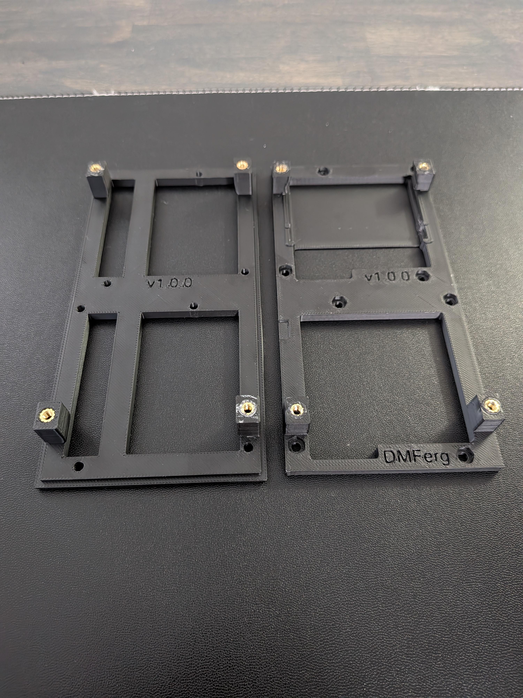
<figcaption>End plates</figcaption>
</figure>
<figure style="flex: 1 1 200px; text-align: center; margin: 0;" markdown>
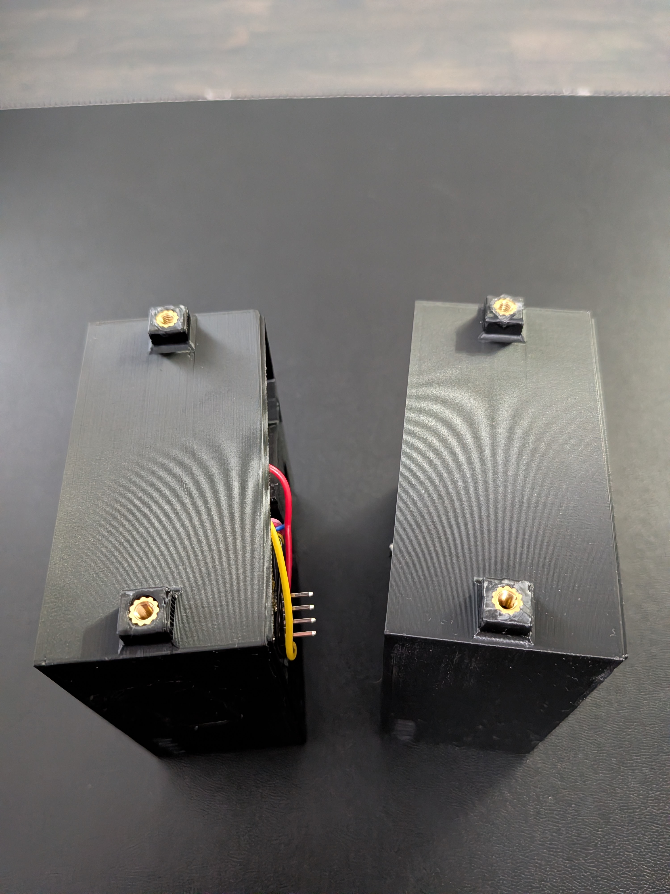
<figcaption>SFD enclosure mounts</figcaption>
</figure>
<figure style="flex: 1 1 200px; text-align: center; margin: 0;" markdown>
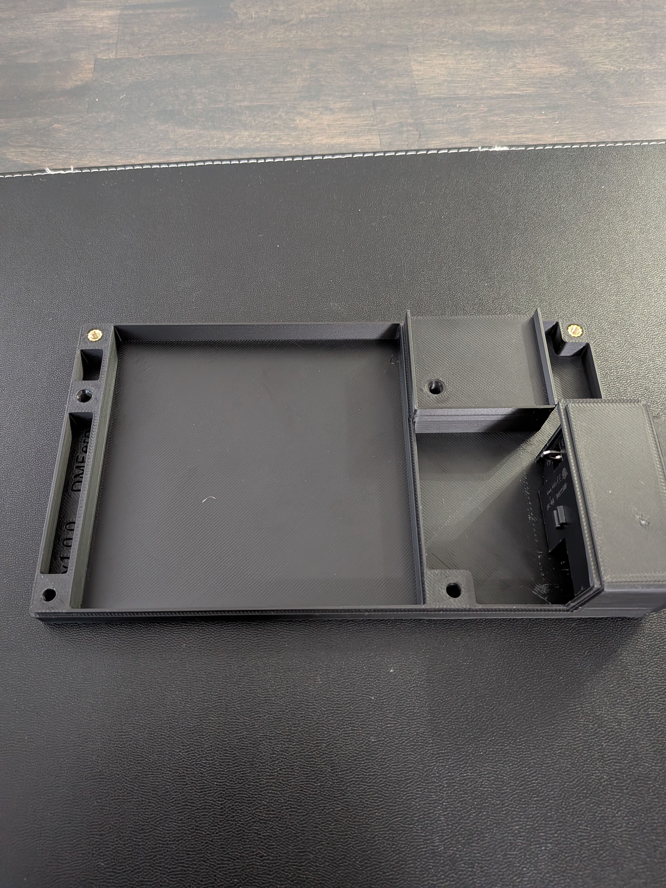
<figcaption>PSU enclosure mounts</figcaption>
</figure>
</div>

## 5. Install Controller Board

Place the [controller board](controller-board.md) in the **left end mount** with the terminals facing down and the USB port facing forward. The fit should be snug — you may need to slightly flex the end mount to allow the board to slide in.

<div style="display: flex; gap: 1rem; margin: 1.5rem 0; flex-wrap: wrap;" markdown>
<figure style="flex: 1 1 200px; text-align: center; margin: 0;" markdown>
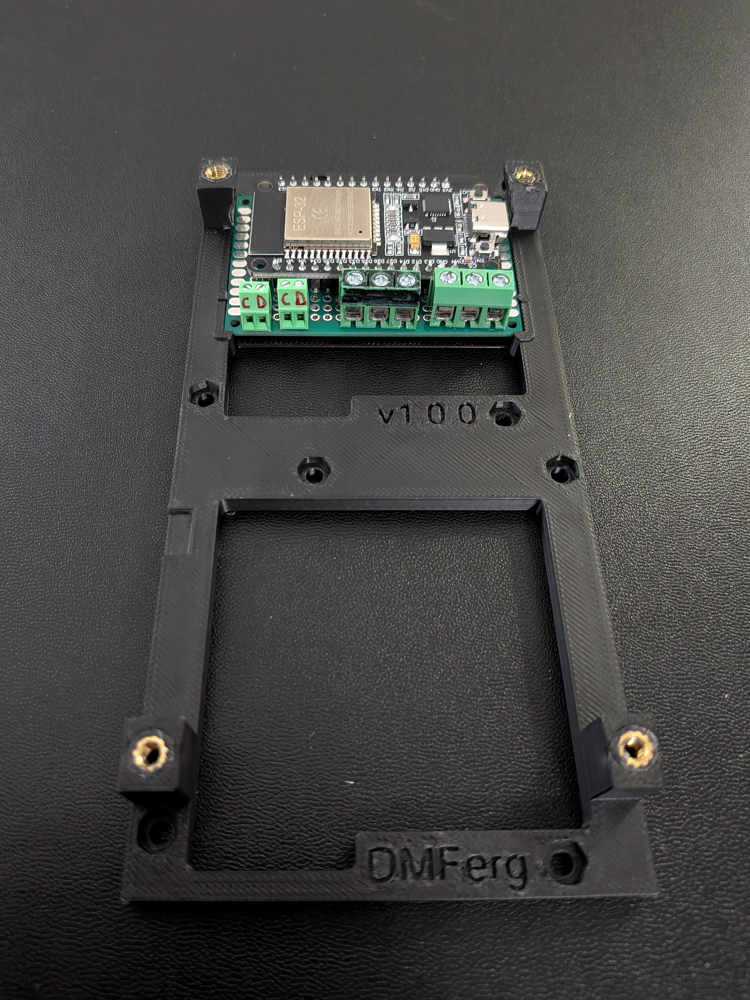
</figure>
<figure style="flex: 1 1 200px; text-align: center; margin: 0;" markdown>
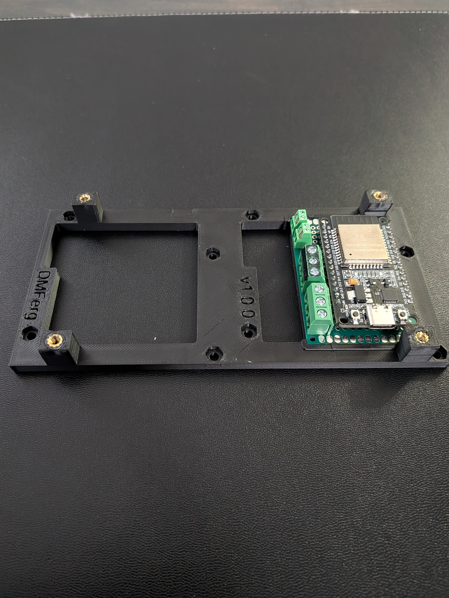
</figure>
</div>

## 6. Connect Modules

Connect all modules together in two rows of 8. **Set the DIP switches on each module before connecting them** — see the [I²C address table](../../../i2c.md#address-assignment-via-dip-switch) for the correct address per position.

!!! tip
    Painter's tape helps hold modules together while you assemble the row.

<a id="stackable-header-note"></a>
!!! warning "Custom PCB — stackable header required"
    If you are using the [dowjames v5.1 custom PCB](../../../module-boards/custom-pcb/dowjames-v5.1/index.md), you'll likely need a **2.54mm 4-pin stackable header** to connect the PCBs. By design, the PCBs are slightly narrower than the enclosure, which makes 8 consecutive boards hard to connect. Place this header between modules 4 & 5 or 5 & 6 on each row.

The diagram below shows how the 16 modules are arranged, **viewed from the back**. Numbering runs 8→1 left to right (mirrored from the front).

For **Option A (Integrated PSU)**, modules 4 and 7 in **Row 2** use the **D.1 mount enclosure** instead of the standard A.1 — these are the positions where the PSU enclosure attaches.

<table style="border-collapse: collapse; text-align: center; width: 100%; table-layout: fixed;">
  <thead>
    <tr>
      <th style="padding: 0.4rem 0.3rem; text-align: left; width: 7rem;">← Back view</th>
      <th style="padding: 0.4rem 0.3rem;">8</th>
      <th style="padding: 0.4rem 0.3rem;">7</th>
      <th style="padding: 0.4rem 0.3rem;">6</th>
      <th style="padding: 0.4rem 0.3rem;">5</th>
      <th style="padding: 0.4rem 0.3rem;">4</th>
      <th style="padding: 0.4rem 0.3rem;">3</th>
      <th style="padding: 0.4rem 0.3rem;">2</th>
      <th style="padding: 0.4rem 0.3rem;">1</th>
    </tr>
  </thead>
  <tbody>
    <tr>
      <td style="padding: 0.4rem 0.3rem; text-align: left; font-weight: bold;">Row 1</td>
      <td style="padding: 0.4rem 0.3rem; border: 1px solid #444;">A.1</td>
      <td style="padding: 0.4rem 0.3rem; border: 1px solid #444;">A.1</td>
      <td style="padding: 0.4rem 0.3rem; border: 1px solid #444;">A.1</td>
      <td style="padding: 0.4rem 0.3rem; border: 1px solid #444;">A.1</td>
      <td style="padding: 0.4rem 0.3rem; border: 1px solid #444;">A.1</td>
      <td style="padding: 0.4rem 0.3rem; border: 1px solid #444;">A.1</td>
      <td style="padding: 0.4rem 0.3rem; border: 1px solid #444;">A.1</td>
      <td style="padding: 0.4rem 0.3rem; border: 1px solid #444;">A.1</td>
    </tr>
    <tr>
      <td style="padding: 0.4rem 0.3rem; text-align: left; font-weight: bold;">Row 2</td>
      <td style="padding: 0.4rem 0.3rem; border: 1px solid #444;">A.1</td>
      <td style="padding: 0.4rem 0.3rem; border: 1px solid #444; font-weight: bold; background: #b45309; color: #fff;">D.1</td>
      <td style="padding: 0.4rem 0.3rem; border: 1px solid #444;">A.1</td>
      <td style="padding: 0.4rem 0.3rem; border: 1px solid #444;">A.1</td>
      <td style="padding: 0.4rem 0.3rem; border: 1px solid #444; font-weight: bold; background: #b45309; color: #fff;">D.1</td>
      <td style="padding: 0.4rem 0.3rem; border: 1px solid #444;">A.1</td>
      <td style="padding: 0.4rem 0.3rem; border: 1px solid #444;">A.1</td>
      <td style="padding: 0.4rem 0.3rem; border: 1px solid #444;">A.1</td>
    </tr>
  </tbody>
</table>

**A.1** — Standard SFD Enclosure &nbsp;|&nbsp; **D.1** — Mount Enclosure (Option A — Integrated PSU only)

<div style="display: flex; gap: 1rem; margin: 1.5rem 0; flex-wrap: wrap;" markdown>
<figure style="flex: 1 1 200px; text-align: center; margin: 0;" markdown>
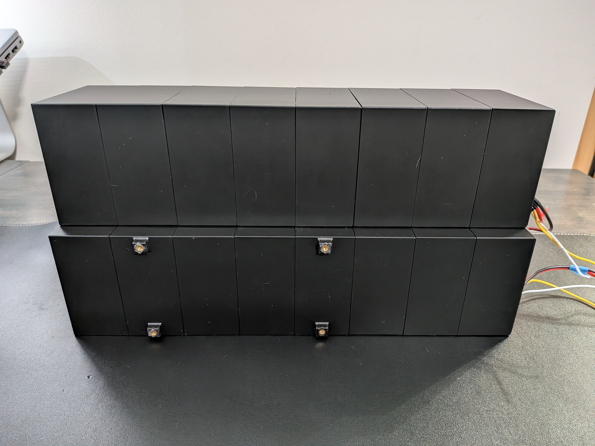
<figcaption>Backside/figcaption>
</figure>
<figure style="flex: 1 1 200px; text-align: center; margin: 0;" markdown>
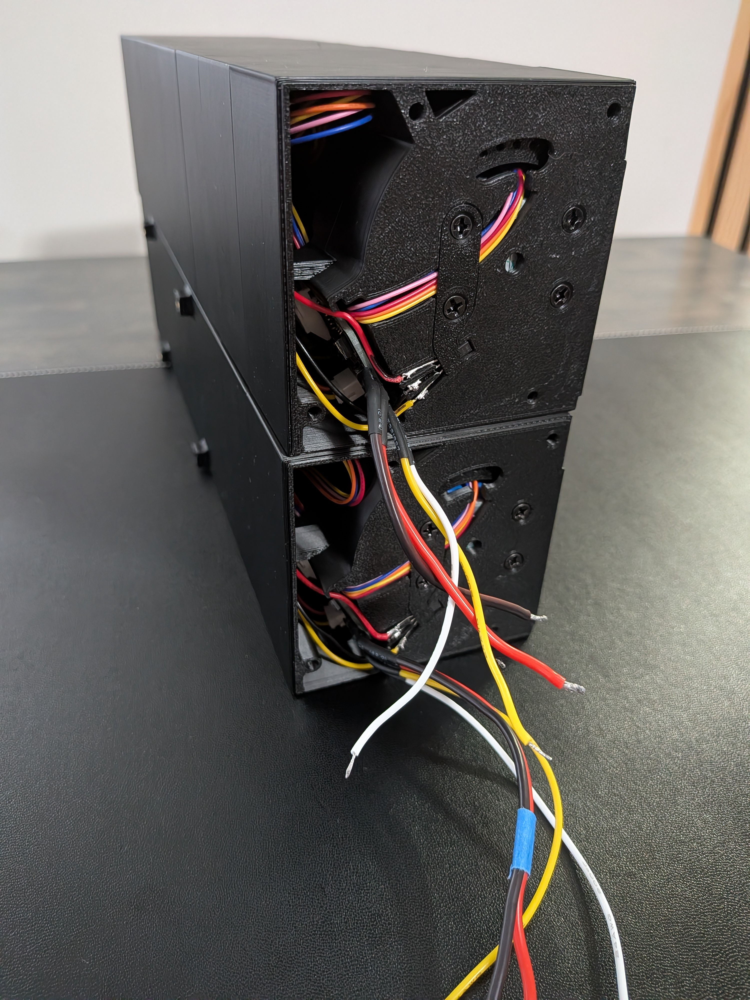
<figcaption>End plates</figcaption>
</figure>
</div>

## 7. Connect End Plates

Connect the end plates to each side and insert the threaded rods into all 8 holes. **Be careful not to push too hard on the lower front hole** that slots through the flaps — you may hit a couple of flaps, but gently twisting the rod should let it pass. Finally, install 8 M3 nuts on each side. Hand-tighten enough to secure all modules, but not so much that the end modules get squeezed and the flap drums rub against the inside of the enclosure.

<div style="display: flex; gap: 1rem; margin: 1.5rem 0; flex-wrap: wrap;" markdown>
<figure style="flex: 1 1 200px; text-align: center; margin: 0;" markdown>
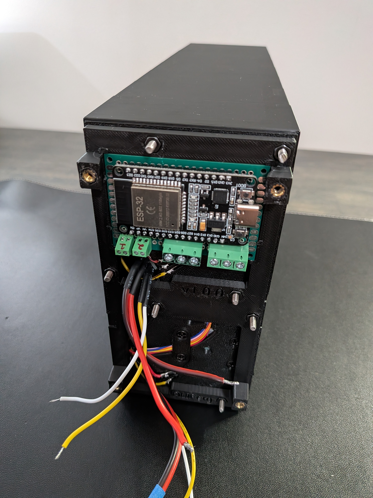
</figure>
<figure style="flex: 1 1 200px; text-align: center; margin: 0;" markdown>
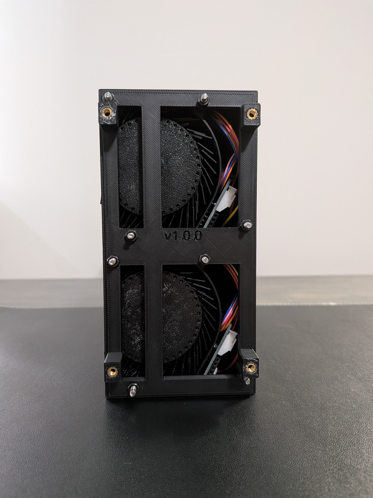
</figure>
</div>

## 8. Wire Controller Board to Modules

The [controller board](controller-board.md) provides two independent daisy-chain outputs:

- **Bus 1** (GPIO 21/22 — left terminal) — connects to the first chain (top row) of up to 8 split-flap modules
- **Bus 2** (GPIO 33/32 — right terminal) — connects to the second chain (bottom row) of up to 8 split-flap modules

Each split-flap PCB has NEXT/PREV headers that daisy-chain along the row. The controller board's I²C outputs feed the first module in each chain; the modules then daisy-chain through their onboard headers.

Connect the I²C wires you soldered in [step 2](#2-solder-module-wires) to the matching I²C output terminals on the controller board.

{ width="500" .center }

*External wiring — 5V power input from the PSU on one side, Bus 1 and Bus 2 outputs to the split-flap daisy chains on the other*

<div style="display: flex; gap: 1rem; margin: 1.5rem 0; flex-wrap: wrap;" markdown>
<figure style="flex: 1 1 200px; text-align: center; margin: 0;" markdown>
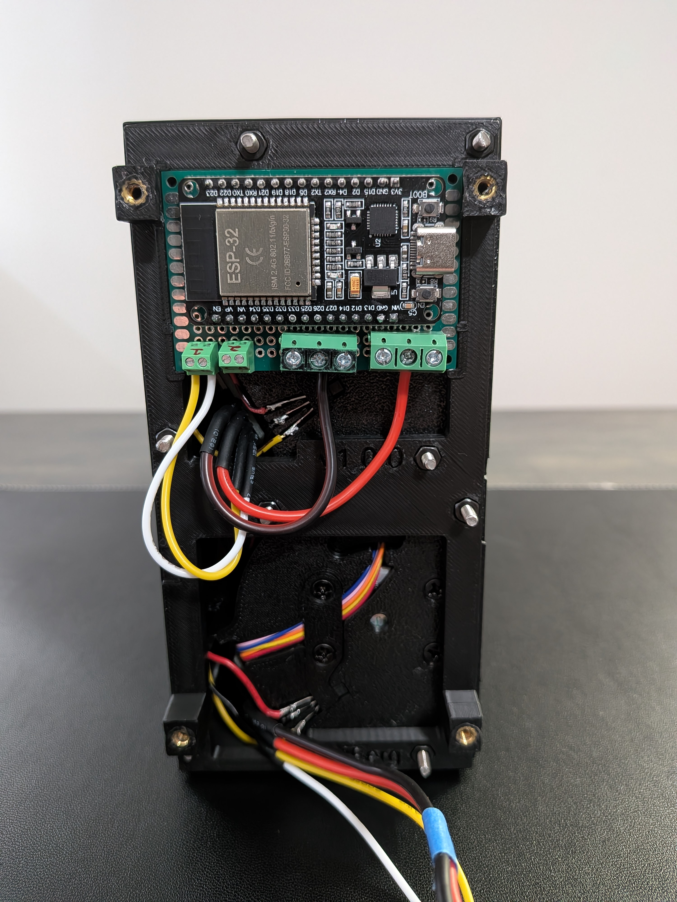
</figure>
<figure style="flex: 1 1 200px; text-align: center; margin: 0;" markdown>
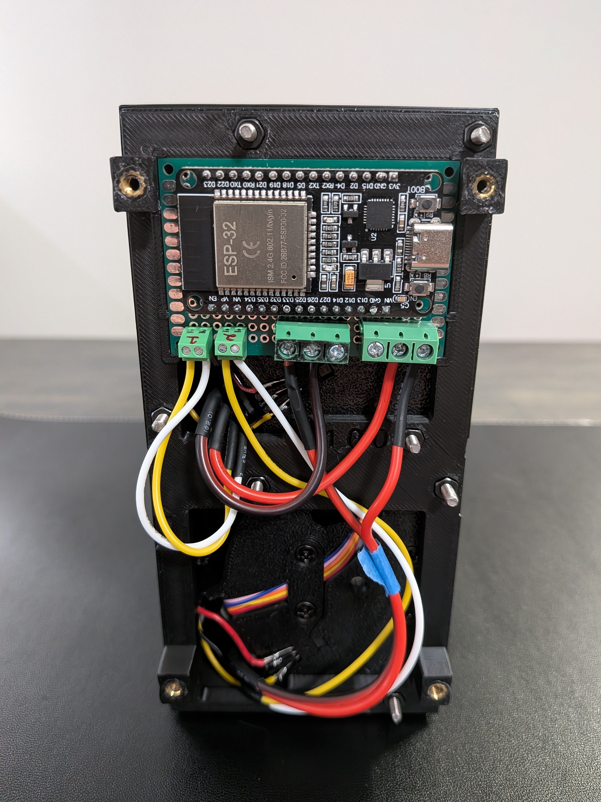
</figure>
</div>

!!! tip "Test before closing the enclosure"
    This is a good time to flash the firmware (if you haven't already) and verify all 16 modules respond and home correctly. It's much easier to troubleshoot a misbehaving module now than after the enclosure is sealed.

---

The next steps depend on which power option you chose. Skip to the section that matches your build.

=== "Option A — Integrated PSU"

    !!! warning "Mains voltage"
        These steps involve 120V AC wiring. If you're not comfortable working with mains voltage, get help from someone who is.

    ### A.9. Install PSU Hardware

    You'll end up removing these when you wire them up, but it's good to verify everything fits first.

    - **Mount the LRS-75-5** into the PSU enclosure.
    - **(Optional)** Install the [Shelly 1PM Gen4](../bom.md#power-supply) for smart power monitoring.
    - **Install the Main Power Switch** into its 3D-printed mount with the switch facing the bottom.

    !!! warning "Switch is hard to remove once installed"
        Once pressed in, the switch is nearly impossible to remove without breaking the printed mount. Verify the mount has no imperfections and that you have the correct orientation before installing.

    <div style="display: flex; gap: 1rem; margin: 1.5rem 0; flex-wrap: wrap;" markdown>
    <figure style="flex: 1 1 200px; text-align: center; margin: 0;" markdown>
    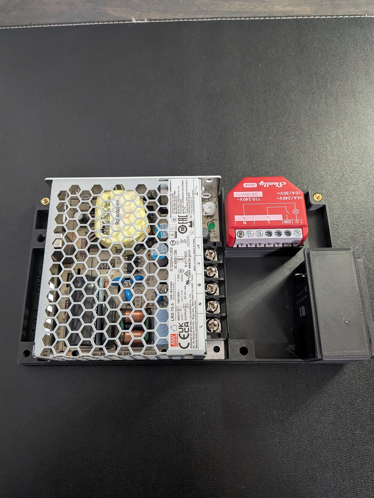
    </figure>
    <figure style="flex: 1 1 200px; text-align: center; margin: 0;" markdown>
    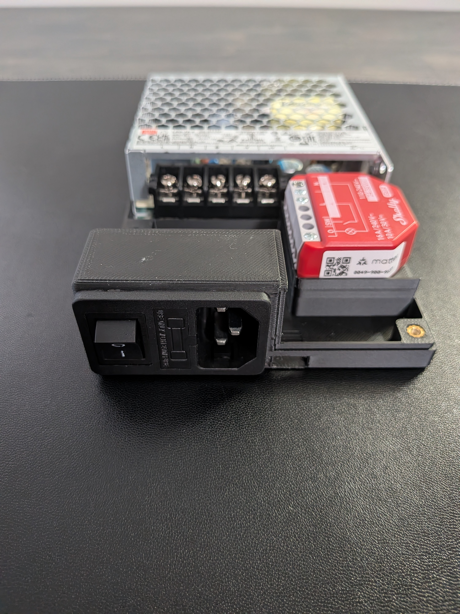
    </figure>
    <figure style="flex: 1 1 200px; text-align: center; margin: 0;" markdown>
    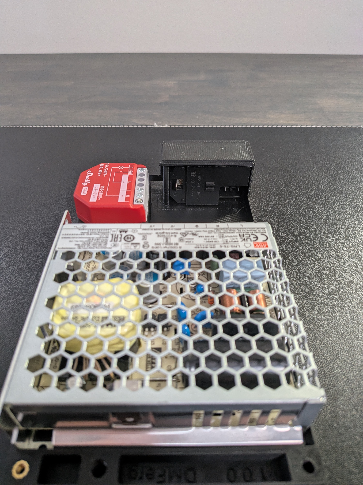
    </figure>
    </div>

    ### A.10. Prepare PSU Wires

    Use **16 AWG** for 120V lines. Cut and terminate wires based on whether you installed the Shelly.

    === "With Shelly"

        ```mermaid
        graph TD
            SHELLY["Shelly 1PM Gen4"]

            PSU["LRS-75-5 PSU"]
            OUTLET["AC Outlet"]

            OUTLET -- "GND · ~70mm · spade→ring" --> PSU
            OUTLET -- "LINE · ~80mm · spade→ferrule" --> SHELLY
            OUTLET -- "NEUTRAL · ~90mm · spade→ferrule" --> SHELLY
            SHELLY -- "LINE · ~90mm · ferrule→ring" --> PSU
            SHELLY -- "NEUTRAL · ~80mm · ferrule→ring" --> PSU
        ```

        | Wire | From | To | Length | From Connector | To Connector |
        |---|---|---|---|---|---|
        | GND | Outlet (G) | PSU (G) | ~70mm | Female spade | M4 ring |
        | LINE | Outlet (L) | Shelly (L) | ~80mm | Female spade | Wire ferrule |
        | NEUTRAL | Outlet (N) | Shelly (N) | ~90mm | Female spade | Wire ferrule |
        | LINE | Shelly (O) | PSU (L) | ~90mm | Wire ferrule | M4 ring |
        | NEUTRAL | Shelly (N) | PSU (N) | ~80mm | Wire ferrule | M4 ring |

        <div style="display: flex; gap: 1rem; margin: 1.5rem 0; flex-wrap: wrap;" markdown>
        <figure style="flex: 1 1 200px; text-align: center; margin: 0;" markdown>
        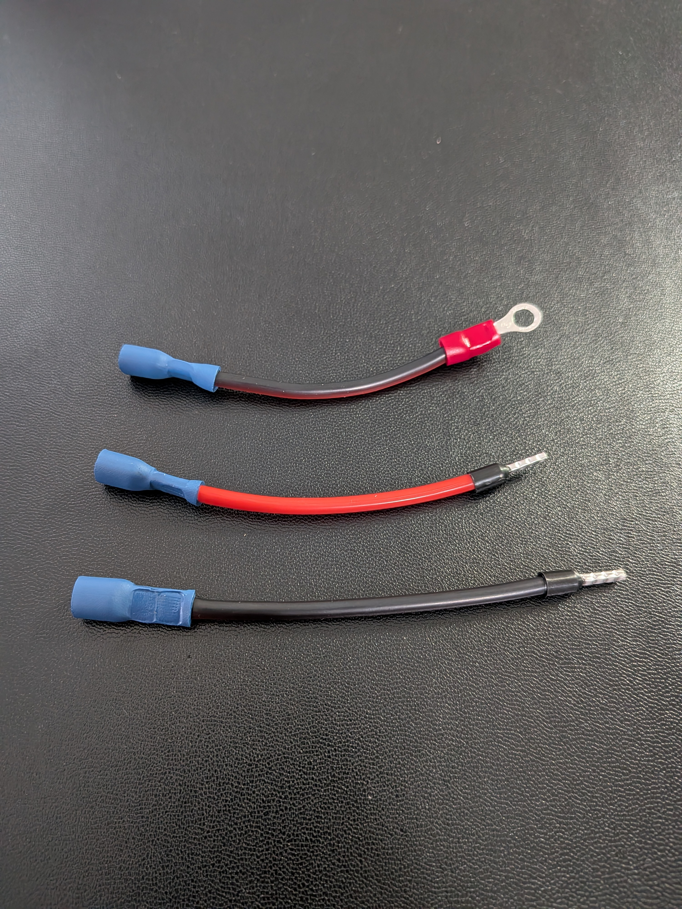
        <figcaption>GND, LINE, and NEUTRAL from the Outlet</figcaption>
        </figure>
        <figure style="flex: 1 1 200px; text-align: center; margin: 0;" markdown>
        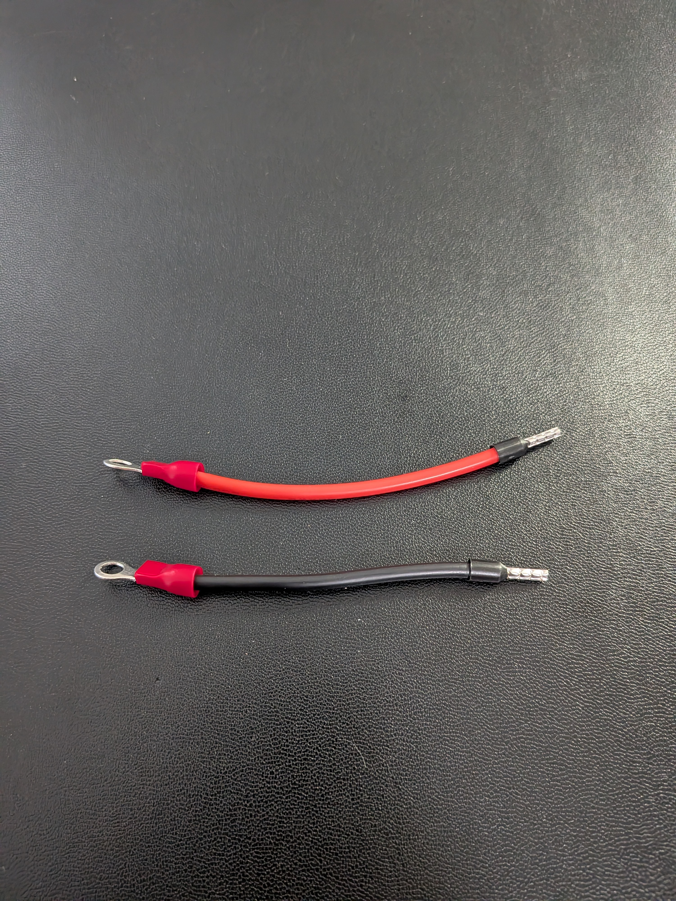
        <figcaption>LINE and NEUTRAL from PSU</figcaption>
        </figure>
        </div>

    === "Without Shelly"

        ```mermaid
        graph TD
            OUTLET["AC Outlet"]
            PSU["LRS-75-5 PSU"]

            OUTLET -- "GND · ~70mm · spade→ring" --> PSU
            OUTLET -- "LINE · ~70mm · spade→ring" --> PSU
            OUTLET -- "NEUTRAL · ~70mm · spade→ring" --> PSU
        ```

        | Wire | From | To | Length | From Connector | To Connector |
        |---|---|---|---|---|---|
        | GND | Outlet (G) | PSU (G) | ~70mm | Female spade | M4 ring |
        | LINE | Outlet (L) | PSU (L) | ~70mm | Female spade | M4 ring |
        | NEUTRAL | Outlet (N) | PSU (N) | ~70mm | Female spade | M4 ring |

    Use **18 AWG** for 5V lines. I'd recommend keeping the wires paired and not separating them.

    | Wire | From | To | Length | From Connector | To Connector |
    |---|---|---|---|---|---|
    | 5v | PSU (V+) | Controller Board (+5v Terminal) | ~280mm | M4 ring | Wire ferrule |
    | GND | PSU (V-) | Controller Board (GND Terminal) | ~280mm | M4 ring | Wire ferrule |

    pic


    ### A.11. Wire the PSU

    You can now correct all the power hardware together.

    === "With Shelly"

        Start by screwing down the 3 AC wires to the PSU terminals first. Then connect the Line and Neutral wires to the outlet — use the same outlet pins as shown in the photo.

        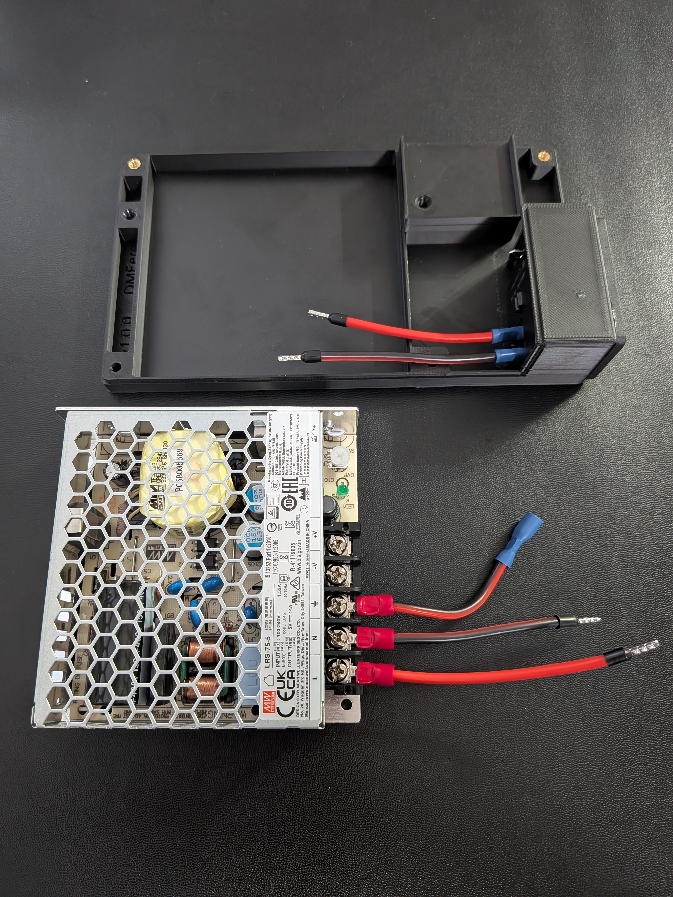{ width="500" .center }

        Next, place the LRS-75-5 into the enclosure and connect all the wires.

        <div style="display: flex; gap: 1rem; margin: 1.5rem 0; flex-wrap: wrap;" markdown>
        <figure style="flex: 1 1 200px; text-align: center; margin: 0;" markdown>
        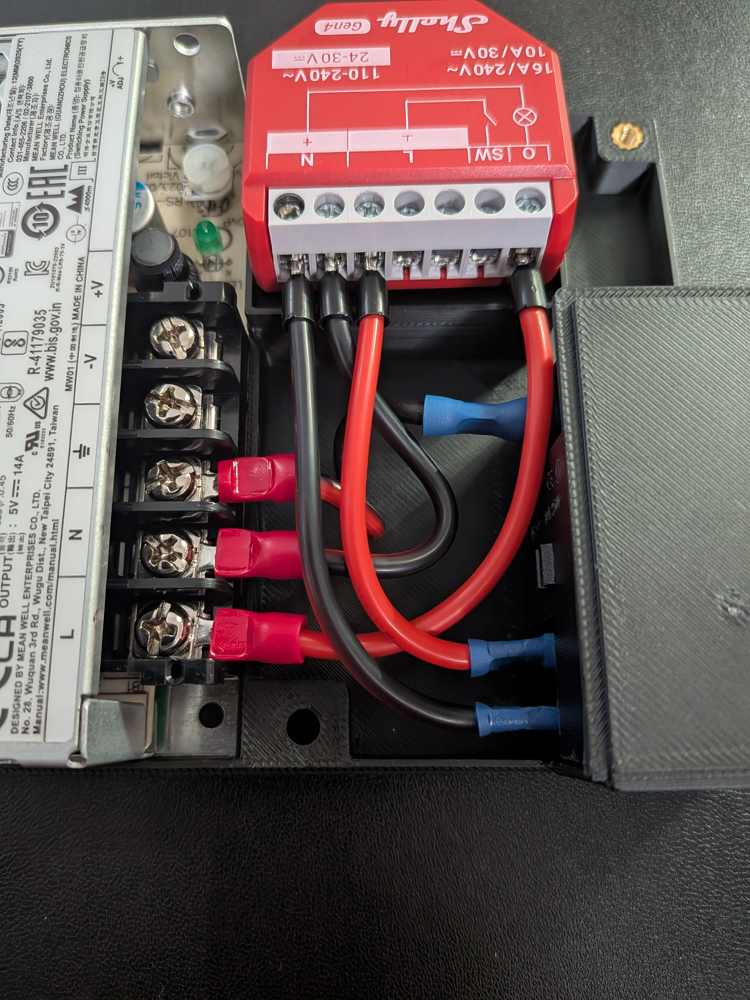
        </figure>
        <figure style="flex: 1 1 200px; text-align: center; margin: 0;" markdown>
        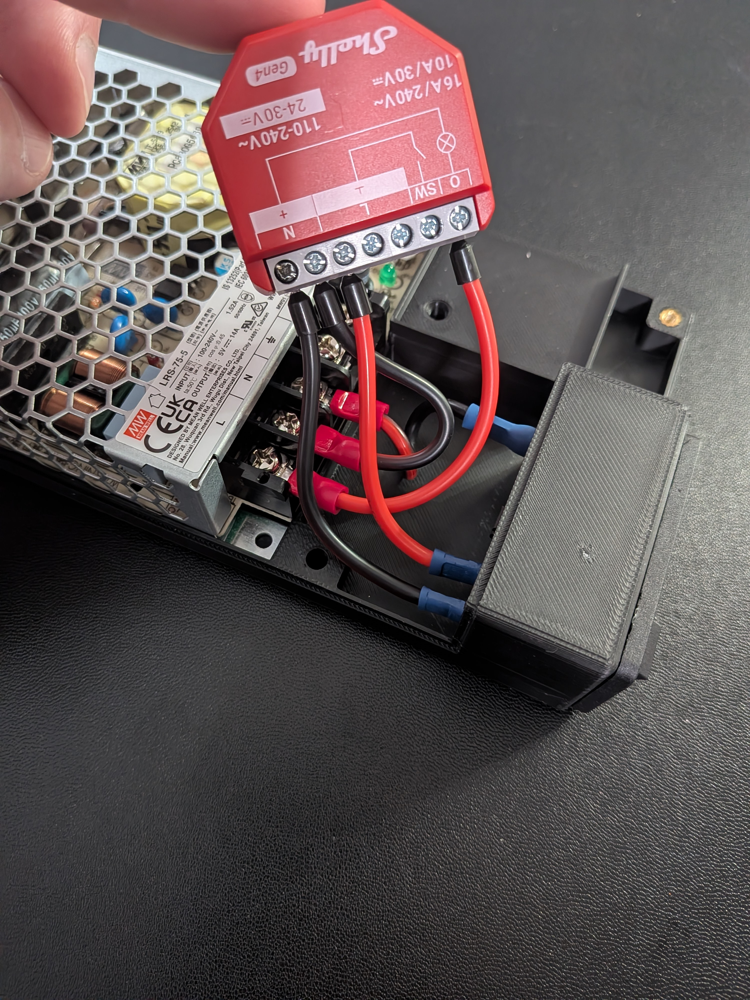
        </figure>
        <figure style="flex: 1 1 200px; text-align: center; margin: 0;" markdown>
        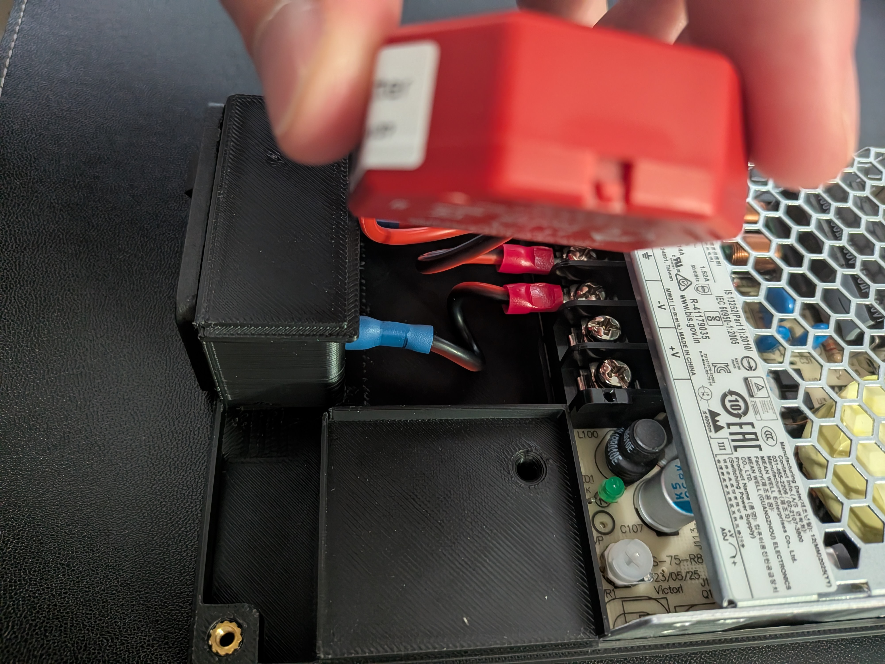
        <figcaption>Note the twist in the GND wire.</figcaption>
        </figure>
        </div>

    === "Without Shelly"

        Start by screwing down the 3 AC wires to the PSU terminals first. Then connect all 3 to the outlet. (Use the "With Shelly" option for photos if needed) 

    
    ### A.12. Mount the PSU Enclosure

    Screw the PSU enclosure to the back of the display using the **M3 × 12mm screws** through the two middle holes, connecting into the D.1 mounts. You'll need to pull the shelly to the side to install the second screw.

    pic

    ### A.13. Connect PSU to Controller Board

    Thread the ferrules end of the 5v wires under the shelly wires and through the output hole on the PSU enclosure, just next to the outlet mount.
    Leaving the ring end of the 5v wires next to the +V/-V output terminals of the PSU. Screw them down. 

    pic

    Thread the ferrules ends through the hole on the end cap (part D.2). Don't connect the end cap to the end plate yet. First, screw the two ferrule ends into the +5v and GND Terminals on the Controller Board. 
    
    NOTE: **Double-check all wiring one last time** before closing the enclosure.

    pic

    Then line the end cap up over the end plate and close it be leave a small gap. Next place the wire cover end in the PSU enclosure, be sure the route the 5v wires in the cover, and align the other end over the hole on the end cap. Once aligned push the end cap all the way one, while simultaneously pushing the end of the wire cover into the hole. If done correctly the wire cover should be locked in place. 

    pic

    ### A.14. Close the Enclosure

    - Place the PSU cable cover into the PSU enclosure.
    - Open the end cap just enough for the wire cover to slot into the end cap hole — the wire cover should be secure once the end cap is in place.
    - Tighten down the end cap screws.
    - Screw on the PSU enclosure top.

    ### A.15. Power On & Test

    Plug in the power cord, flip the main switch, and verify the display boots and all modules respond.

=== "Option B — External Adapter"

    ### B.9. Install Barrel Jack

    Cut the 5V/GND wires to approximately 100mm. Connect one end to the controller board's 5V/GND input terminals, and the other end to the barrel jack. Place the barrel jack into the cutout in the **C.1 or C.2 left end cap** (matched to your jack size).

    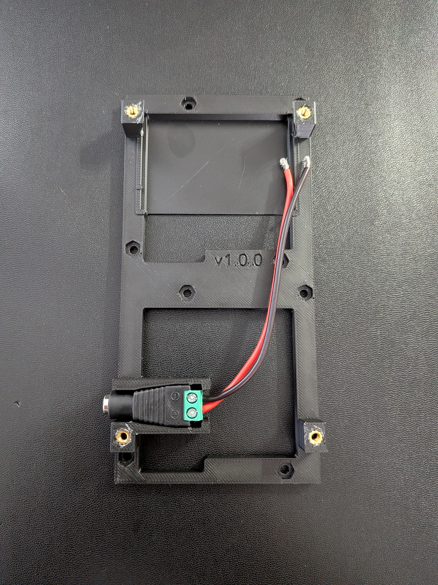{ width="500" .center }

    ### B.10. Close the Enclosure

    Screw on the end caps. Make sure the barrel jack is seated properly in the cutout.

    ### B.11. Power On & Test

    Plug in the external 5V power supply and verify the display boots and all modules respond.

    <div style="display: flex; gap: 1rem; margin: 1.5rem 0; flex-wrap: wrap;" markdown>
    <figure style="flex: 1 1 200px; text-align: center; margin: 0;" markdown>
    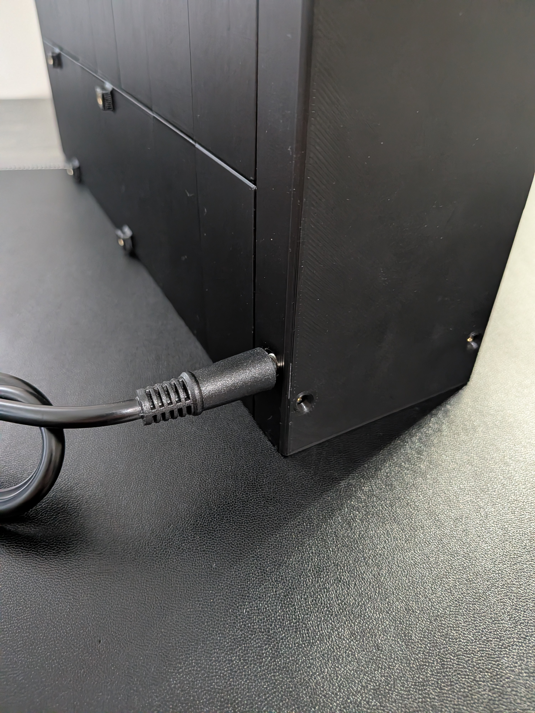
    </figure>
    <figure style="flex: 1 1 200px; text-align: center; margin: 0;" markdown>
    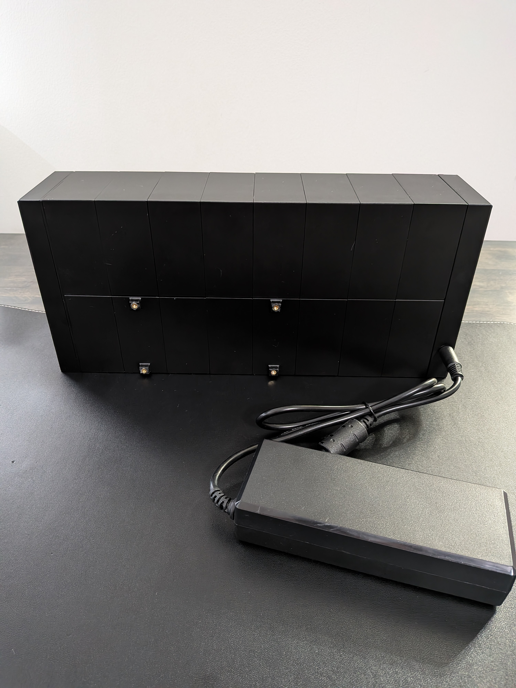
    </figure>
    </div>
