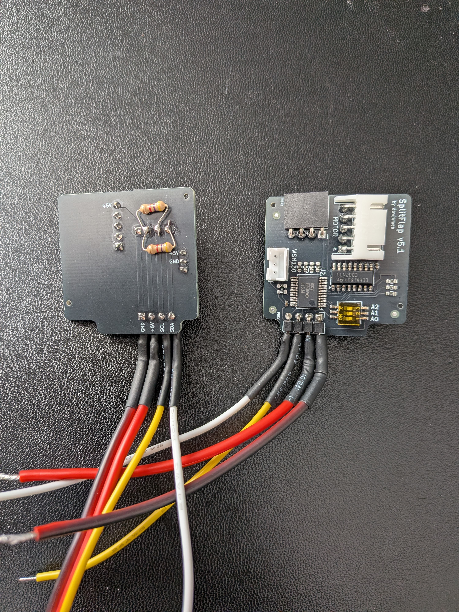
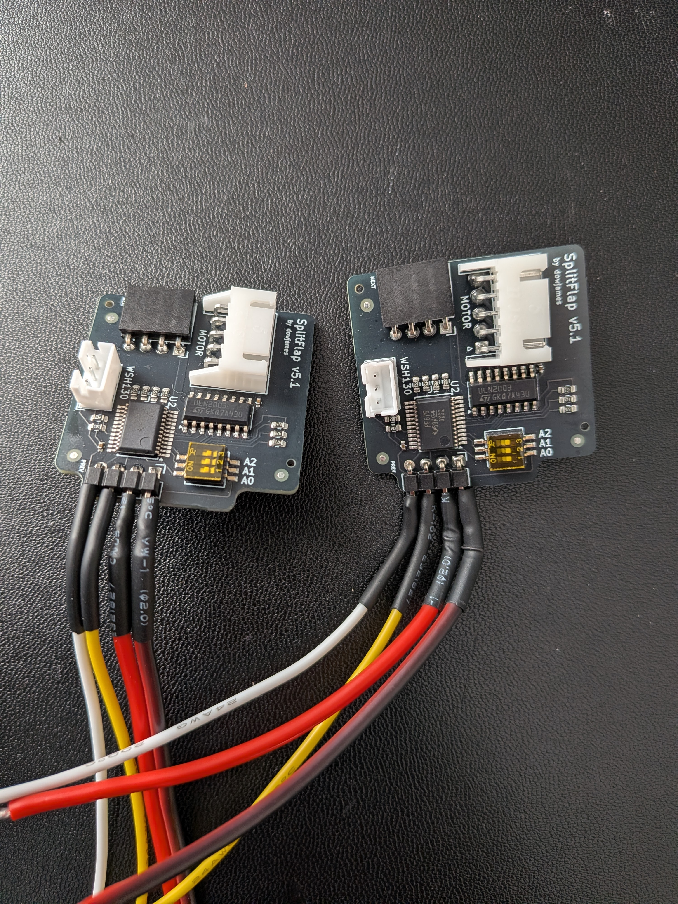
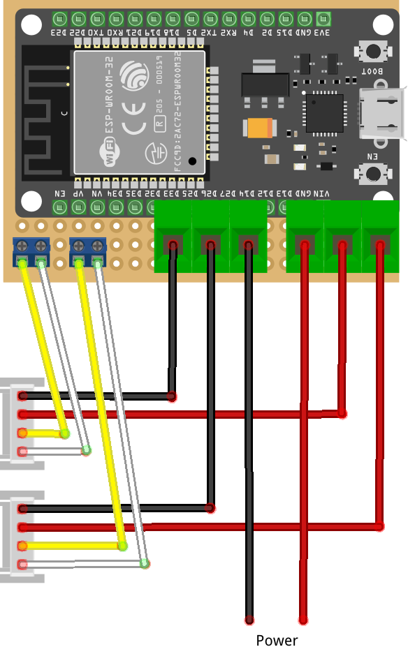
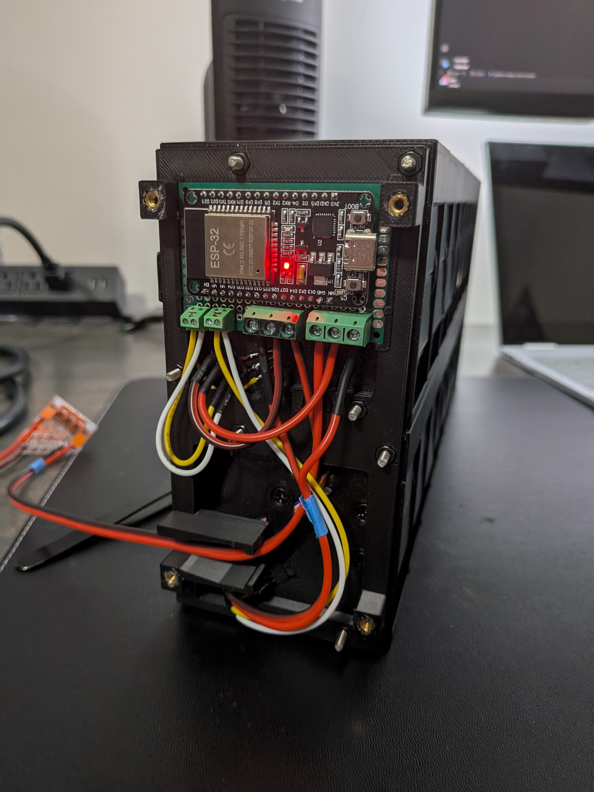

# Assembly

Note: most of the build steps from the [original guide](../../original/index.md) still apply. So these steps won't go into detail for items already documented. If there is something missing, please create an issue and it'll be addressed.

## 1. Build Modules

Building each individual module is essentially the same as the original design. This includes:

- Installing the motor and hall sensor in the enclosure
- Assembling the drum with flaps and magnet
- Connecting the diy or custom pcb module board

## 2. Solder Module Wires

Regardless of the module board you are using, you'll want to solder wires with the correct length to the first module board before connecting all modules. I used 18 awg wire for 5v/GND and 14 awg for both i2c wires.  Approximate wire lengths:

- Row 1 (top): 90mm
- Row 2 (bottom) 140mm

!!! tip "How I wired the first module"
    I used the [dowjames v5.1 custom PCB](../../../module-boards/custom-pcb/dowjames-v5.1/index.md) and soldered the wires directly to the PREV header pins, then added heat shrink tubing for protection. You'll also notice the pull-up resistors soldered on.

<figure style="flex: 1 1 200px; text-align: center; margin: 0;" markdown>

</figure>
<figure style="flex: 1 1 200px; text-align: center; margin: 0;" markdown>

</figure>

## 3. Prepare Threaded Rods

Cut all 8 threaded rod down to about 230mm (minimum 225mm). Doesn't have to be exact as there should be some extra room at both ends, between the rods and the end caps.

## 4. Install Heat Set Inserts

Use a soldering iron to install the heat set inserts into:

- Left end mount
    - M3 × 4 × 5 Heat Set Insert x 4
- Right end mount
    - M3 × 4 × 5 Heat Set Insert x 4
- (if using Option A — Integrated PSU) Enclosure mount x2 
    - M3 × 6 × 5 Heat Set Insert x 4

Make sure there isn't any melted plastic pushed up as you sink the heat set inserts. This will prevent the end caps from sitting flush, leaving gaps in you enclosure. You can use a knife to cut them off.

## 5. Install Controller Board

Place the controller board in the left end plate with the terminals facing down and the usb port facing forwards. The fit is tight should be snug, you might need to slightly bend the end plate just enough to allow the board to slide in. 

## 6. Connect Modules

Connect all modules together in two rows of 8. Ensure you set the dip switches to each module before you connect them together.

!!! tip
    Painter's tape helps hold modules together while you assemble the row.

!!! warning "Custom PCB — stackable header required"
    If you are using the [dowjames v5.1 custom PCB](../../../module-boards/custom-pcb/dowjames-v5.1/index.md), you'll likely need a **2.54mm 4-pin stackable header** to connect the PCBs. By design, the PCBs are slightly narrower than the enclosure, which makes 8 consecutive boards hard to connect. Place this header between modules 4 and 5 on each row.

The diagram below shows how the 16 modules are arranged, viewed from the back. Numbering runs 8→1 left to right (mirrored from the front).

For **Option A (Integrated PSU)**, modules 4 and 7 in Row 1 use the **D.1 mount enclosure** instead of the standard A.1 — these are the positions where the PSU enclosure attaches.

<table style="border-collapse: collapse; text-align: center; width: 100%; table-layout: fixed;">
  <thead>
    <tr>
      <th style="padding: 0.4rem 0.3rem; text-align: left; width: 7rem;">← Back view</th>
      <th style="padding: 0.4rem 0.3rem;">8</th>
      <th style="padding: 0.4rem 0.3rem;">7</th>
      <th style="padding: 0.4rem 0.3rem;">6</th>
      <th style="padding: 0.4rem 0.3rem;">5</th>
      <th style="padding: 0.4rem 0.3rem;">4</th>
      <th style="padding: 0.4rem 0.3rem;">3</th>
      <th style="padding: 0.4rem 0.3rem;">2</th>
      <th style="padding: 0.4rem 0.3rem;">1</th>
    </tr>
  </thead>
  <tbody>
    <tr>
      <td style="padding: 0.4rem 0.3rem; text-align: left; font-weight: bold;">Row 1</td>
      <td style="padding: 0.4rem 0.3rem; border: 1px solid #444;">A.1</td>
      <td style="padding: 0.4rem 0.3rem; border: 1px solid #444;">A.1</td>
      <td style="padding: 0.4rem 0.3rem; border: 1px solid #444;">A.1</td>
      <td style="padding: 0.4rem 0.3rem; border: 1px solid #444;">A.1</td>
      <td style="padding: 0.4rem 0.3rem; border: 1px solid #444;">A.1</td>
      <td style="padding: 0.4rem 0.3rem; border: 1px solid #444;">A.1</td>
      <td style="padding: 0.4rem 0.3rem; border: 1px solid #444;">A.1</td>
      <td style="padding: 0.4rem 0.3rem; border: 1px solid #444;">A.1</td>
    </tr>
    <tr>
      <td style="padding: 0.4rem 0.3rem; text-align: left; font-weight: bold;">Row 2</td>
      <td style="padding: 0.4rem 0.3rem; border: 1px solid #444;">A.1</td>
      <td style="padding: 0.4rem 0.3rem; border: 1px solid #444; font-weight: bold; background: #b45309; color: #fff;">D.1</td>
      <td style="padding: 0.4rem 0.3rem; border: 1px solid #444;">A.1</td>
      <td style="padding: 0.4rem 0.3rem; border: 1px solid #444;">A.1</td>
      <td style="padding: 0.4rem 0.3rem; border: 1px solid #444; font-weight: bold; background: #b45309; color: #fff;">D.1</td>
      <td style="padding: 0.4rem 0.3rem; border: 1px solid #444;">A.1</td>
      <td style="padding: 0.4rem 0.3rem; border: 1px solid #444;">A.1</td>
      <td style="padding: 0.4rem 0.3rem; border: 1px solid #444;">A.1</td>
    </tr>
  </tbody>
</table>

**A.1** — Standard SFD Enclosure &nbsp;|&nbsp; **D.1** — Mount Enclosure (Option A — Integrated PSU only4

## 7. Connect End Plates

Connect the end plates to each side, insert the threaded rod into all 8 hole. Be careful not to push to hard on the lower front hole that slots through the flaps. You might hit a couple flaps, but twisting the rod should allow it to pass. Lastly, installed 8 M3 nuts on each side. Hand tighten enough to secure all modules, but not enough to squeeze the end modules too much that the flap drum gets rub against the inside of the enclosure.

## 8. Wire Controller board

The controller board provides two independent daisy-chain outputs:

- **Bus 1 (GPIO 21/22 - left terminal)** — connects to the first chain (top row) of up to 8 split-flap modules
- **Bus 2 (GPIO 33/32 - right terminal)** — connects to the second chain (bottom row) of up to 8 split-flap modules

Each split-flap PCB has NEXT/PREV headers that daisy-chain along the row. The controller board's I²C outputs feed the first module in each chain; the modules then daisy-chain through their onboard headers.

{ width="500" .center }

*External wiring — 5V power input from the PSU on one side, Bus 1 and Bus 2 outputs to the split-flap daisy chains on the other*

{ width="500" .center }

*Fully installed — controller board mounted and powering the dual display*

Remaining steps

Option A — Integrated PSU
  - Mount PSU Enclosure
    - screw the middle holes using the M3 × 12mm screws
  - Wire PSU
    - Cutting wires to correct lengths for the, add/crimp ferrules/connectors
  - Install PSU hardware
    - Install Main Power Switch in mount. Place power switch on the bottom. Note: once you install the switch, it's pretty much impossible to remove without breaking the 3d printed mount. Be sure the 3d printed part has no imperfections preventing use and you use the correct orientation. 
    - Screw down the correct Line, Neutral, and Ground (120v) wires/connectors to the LRS-75-5
    - OPTIONAL - install the shelly and connect wires
  - Wire PSU to Display
    - Connect 5v/GND wires to controller board, thread the wires through the hole on the backside of the end cap and place end on the end plate. Note, do not screw it down yet.
    - Thread the 5v/GND wire through the hole in the PSU enclosure and screw down the terminals connecting it to the PSU. 
    - Double check all wiring one last time before finishing off enclosure.
    - Place PSU cable cover end in the PSE enclosure, open the cap just enough for the wire cover to slot into the end cap hole. The wire cover should be secure when the end cap is in place. Tighten down end cap screws.
    - Screw on the pus enclosure top.

Option B — External Adapter
  - Install Barrel Jack
    - Involves cutting wire to the correct length, connecting wire to the 5v/gnd terminals on the controller board and barrel jack, placing barrel jack in end plate slot.
  - Final step
    - screw on end caps, plug in external power supply and test.  