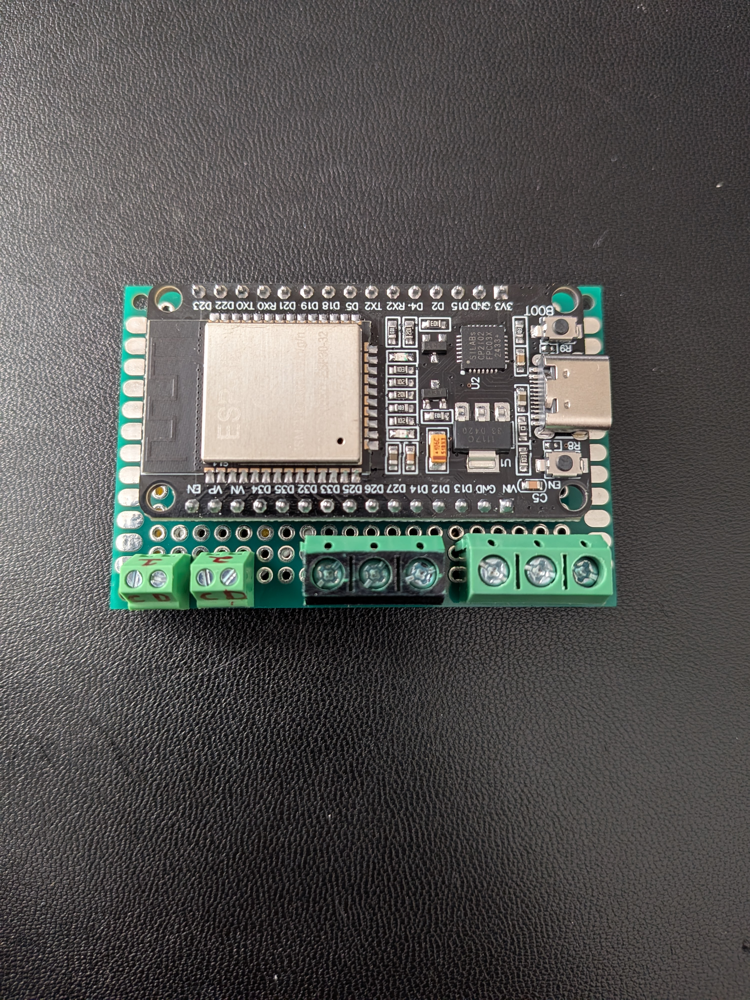
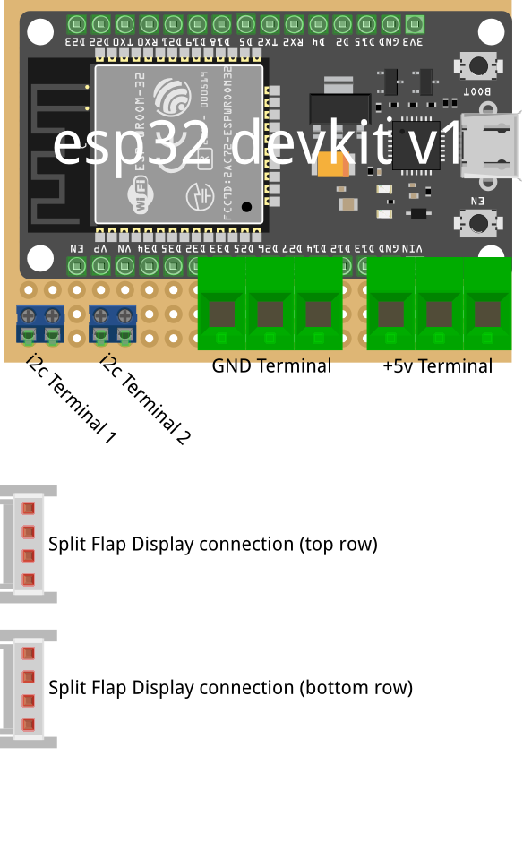
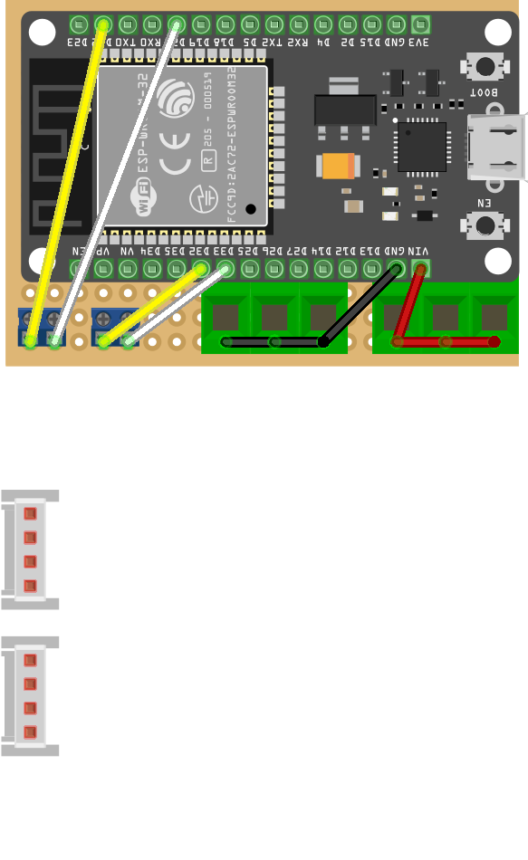
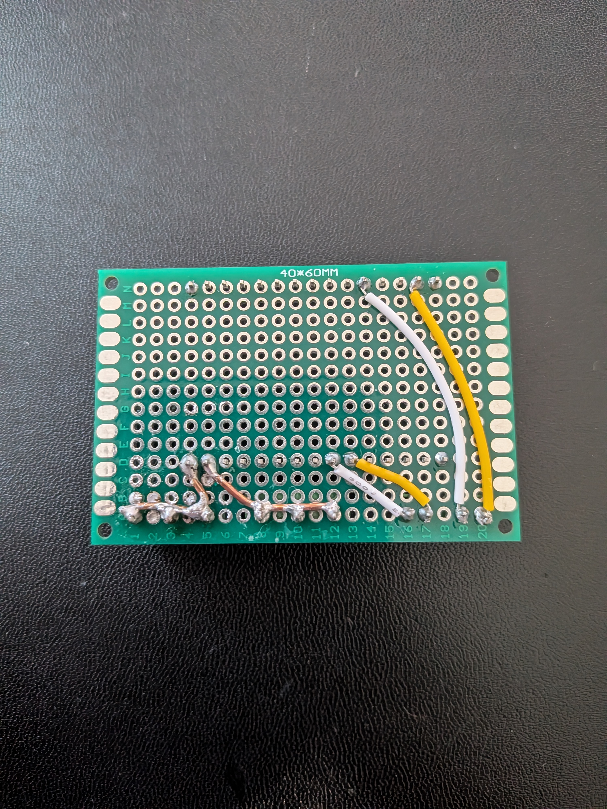
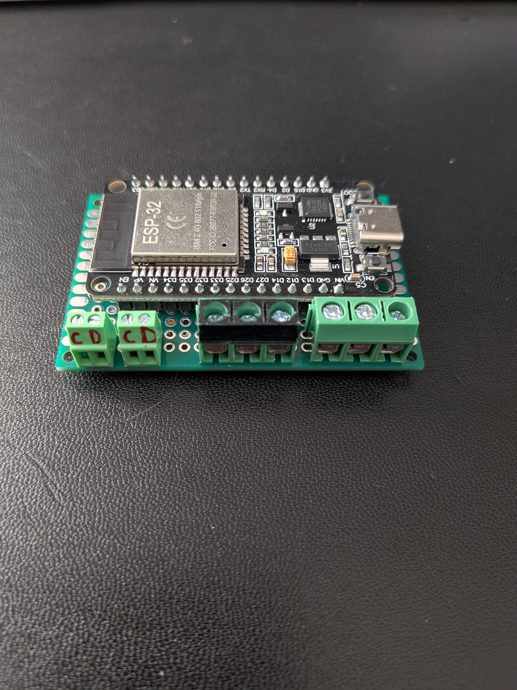
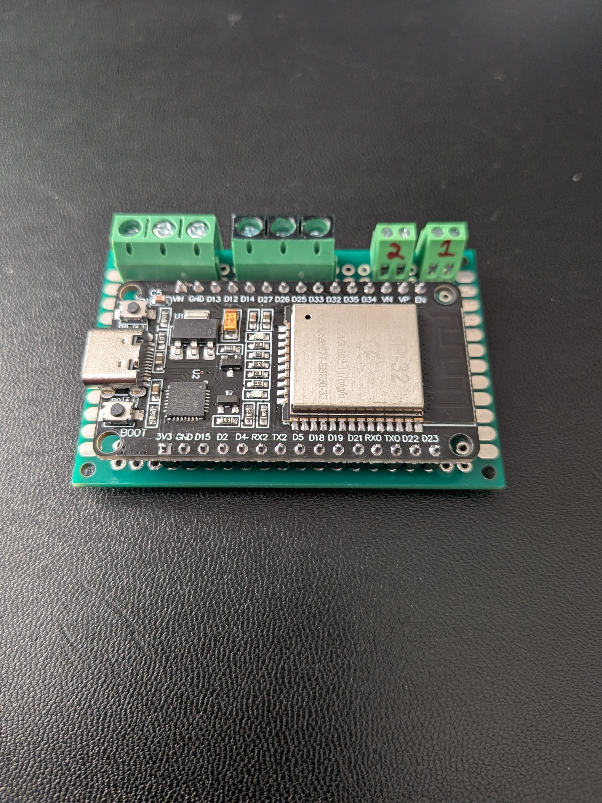
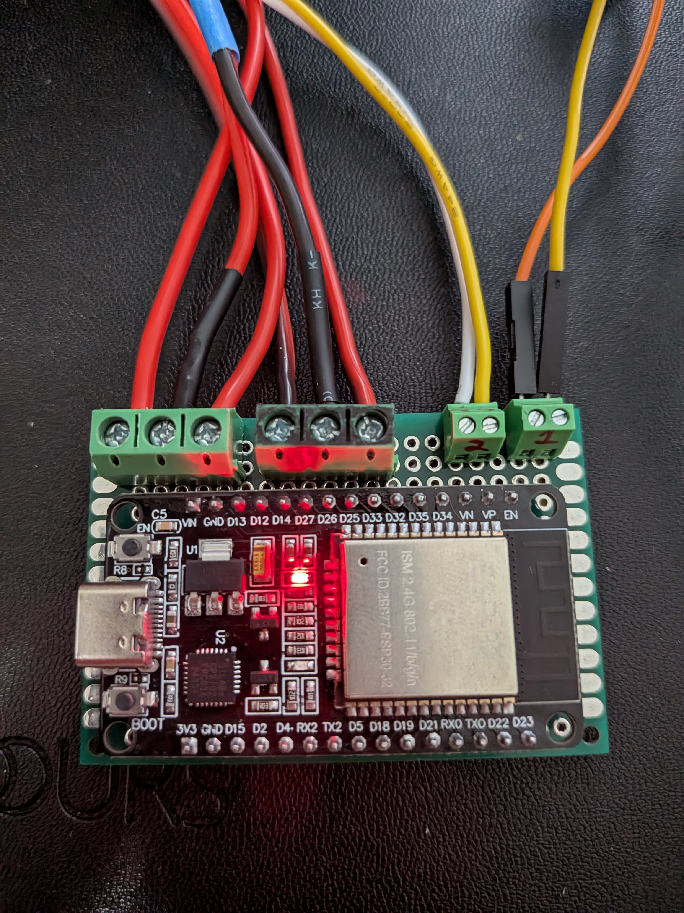

# 2. Controller Board

The dual display configuration uses a custom ESP32 controller board that manages two independent I²C buses (Bus 1 and Bus 2) and coordinates power distribution to support up to 16 split-flap modules. This page covers assembling the perfboard-based design.

{ width="500" .center }

*The assembled ESP32 controller board*

## Overview

The controller board is built on perfboard using:

- **ESP32 microcontroller** — runs the firmware and manages both I²C buses
- **Perfboard with screw terminals** — provides clean connections for power, ground, and I²C signals
- **Wiring and connectors** — interface with the 5V power supply and split-flap PCB daisy chains

## Notes

A few things to keep in mind before you start — this is one working design, not the only one:

- **You don't have to build this controller board.** You can solder wires directly to the ESP32 and skip the perfboard entirely. The controller board exists for easier assembly and disassembly, not because the firmware requires it.
     - The 3d printed enclosure is meant to mount this design. If you choose a different design, you will have to figure out your own mounting setup.
- **The terminal block layout is a personal choice.** Separated and different-sized terminal blocks aren't required — I used what I had on hand and like the spacing between connections. A single multi-position block works fine too.
- **Pull-up resistors are not on this board.** The 4.7kΩ I²C pull-ups for each bus live on the split-flap PCBs (or DIY boards), not on the controller. See the [I²C reference](../../../i2c.md#pull-up-resistors) for placement details.

## Components

Full list of parts can be found in the [BOM](../bom.md). The "Split Flap Display connection" terminals represent the daisy-chain outputs to the first module in each row.

{ width="500" .center }

*Labeled components on the controller board — ESP32 and screw terminals for power input and dual I²C bus outputs*

## Pin Connections

The ESP32 has two dedicated I²C peripherals. The firmware uses these GPIO defaults:

| Signal | Bus 1 | Bus 2 |
|---|---|---|
| **SDA** (data) | GPIO 21 | GPIO 33 |
| **SCL** (clock) | GPIO 22 | GPIO 32 |
| **GND** | GND | GND |

These match the `SDA_PIN`, `SCL_PIN`, `SDA2_PIN`, and `SCL2_PIN` build flags in the firmware.

## Assembly Steps

### 1. Prepare the Perfboard

- Mount the ESP32 on the perfboard using by soldering the pins directly. 
  - You can print the "ESPSpacer" part that should be give the correct height between the ESP32 and perfboard when soldering. This will also align the reboot button on the ESP32 with the enclosure side cutout. So you can easily reboot your esp if needed.
- Make sure you place the EPS32 in the same pins as the pictures, so you won't have any issues installing the board to it's mount.

### 2. Add Screw Terminals

Solder the 4 screw terminal blocks to the perfboard for:

- **+5V Terminal**
- **GND Terminal**
- **i2c Termianl 1**
- **i2c Terminal 2**

### 3. Wire the Internal Connections

Flip the board over:

- Solder the 3 pins of the 5V terminal block and the ESP32 VIN pin together. 
    - I used a solid copper wire, you could solder them all together without a wire if you want.
- Solder the 3 pins of the GND terminal block and the ESP32 GND pin together, same as 5V.
- Solder a pair of jumper wires from the [ESP32 GPIO pins](#pin-connections) to the two different I2C screw terminals.
    - I used 22 awg wire.

{ width="500" .center }

*Top side internal wiring — wires soldered on the back of the perfboard*

{ width="500" .center }

*Bottom side solder joints and wiring — keep traces short and well-soldered to avoid intermittent I²C errors*

### 4. Test Before Installation

- Power on the controller board and check that the ESP32 boots
- Use the firmware's I²C scanner (if available) to verify each bus can detect modules
- Confirm no shorts between 5V and GND

<figure style="flex: 1; text-align: center;" markdown>

<figcaption>Front</figcaption>
</figure>
<figure style="flex: 1; text-align: center;" markdown>

<figcaption>Back</figcaption>
</figure>

{ width="500" .center }

*Power and I²C bus wires connected to the screw terminals for testing before assembly*

---

## Install and Wire Controller Board

TODO!!!

The perfboard provides two independent daisy-chain outputs:

- **Bus 1 (GPIO 21/22 - left terminal)** — connects to the first chain (top row) of up to 8 split-flap modules
- **Bus 2 (GPIO 33/32 - right terminal)** — connects to the second chain (bottom row) of up to 8 split-flap modules

Each split-flap PCB has NEXT/PREV headers that daisy-chain along the row. The controller board's I²C outputs feed the first module in each chain; the modules then daisy-chain through their onboard headers.

{ width="500" .center }

*External wiring — 5V power input from the PSU on one side, Bus 1 and Bus 2 outputs to the split-flap daisy chains on the other*

{ width="500" .center }

*Final installation — controller board mounted and powering the dual display*

## Power Distribution

All power runs through the main 5V supply connected to the controller board's screw terminals. The controller board is responsible for:

- Receiving 5V from the external PSU
- Supplying 5V and GND to the split-flap daisy chains via the output terminals
- The ESP32 itself draws minimal current (~80–100mA); most power goes directly to the motors

## Next Steps

Once the controller board is assembled and tested, proceed to [Assembly](assembly.md) to mount everything into the enclosure.
