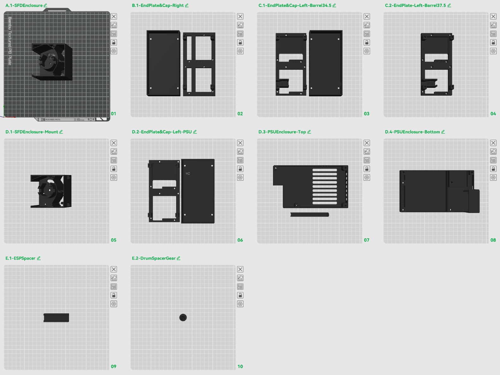

# 1. Printed Parts

All print files are available on MakerWorld — each plate is pre-configured with the correct print settings for each object. You shouldn't need to adjust anything before slicing.

[Download Print Files on MakerWorld](https://makerworld.com/en/models/2836400-split-flap-display-dual#profileId-3161341){ .md-button }

{ width="600" .center }

---

## Which plates do you need?

Which plates you print depends on the [power option](../power.md) you chose. **All builds require plates A, B, and E.** The C and D plates are mutually exclusive based on your power choice.

| Plate | Part | Option A (Integrated PSU) | Option B (External Adapter) |
|---|---|:---:|:---:|
| **A.1** | SFD Enclosure | ✅ ×14 | ✅ ×16 |
| **B.1** | End Plate & Cap — Right | ✅ | ✅ |
| **C.1** | End Plate & Cap — Left (Barrel 34.5mm) | ❌ | ✅ one of C.1 or C.2 |
| **C.2** | End Plate & Cap — Left (Barrel 37.5mm) | ❌ | ✅ one of C.1 or C.2 |
| **D.1** | SFD Enclosure Mount | ✅ ×2 | ❌ |
| **D.2** | End Plate & Cap — Left (PSU) | ✅ | ❌ |
| **D.3** | PSU Enclosure — Top + Wire Cover | ✅ | ❌ |
| **D.4** | PSU Enclosure — Bottom | ✅ | ❌ |
| **E.1** | ESP Spacer | ✅ | ✅ |
| **E.2** | Drum Spacer Gear | ⚪ optional | ⚪ optional |

---

!!! tip "Smooth plate recommendations"
    Print the following on a **smooth PEI plate** for a clean visible surface finish:

    - **B.1** — end cap (right)
    - **C.1 / C.2** — end cap (left, barrel jack)
    - **D.2** — end cap (left, PSU)
    - **D.3** — PSU enclosure top

---

## Plate details

### A.1 — SFD Enclosure

The main module enclosure body.

- **Option A:** print **14** — the remaining 2 slots are covered by the D.1 enclosure mounts
- **Option B:** print **16**

| File |
|---|
| `v1.0.0-sfd-enclosure.stl` |

### B.1 — End Plate & Cap — Right

The right-side end plate and cap. One per dual display.

| File |
|---|
| `v1.0.0-end-plate-r.stl` |
| `v1.0.0-end-cap-r.stl` |

### C — End Plate & Cap — Left (Barrel Jack)

*Option B (External Adapter) only.* Left-side end plate and cap with a cutout for the barrel jack power connector. The cap (`v1.0.0-end-cap-l-bar.stl`) is the same for both sizes — only the plate differs.

- **C.1** — for a **34.5mm** barrel jack
- **C.2** — for a **37.5mm** barrel jack

Measure your barrel jack diameter before printing. One per dual display.

| Plate | File |
|---|---|
| C.1 & C.2 | `v1.0.0-end-cap-l-bar.stl` |
| C.1 | `v1.0.0-end-plate-l-bar-34.stl` |
| C.2 | `v1.0.0-end-plate-l-bar-37.stl` |

### D — Integrated PSU Enclosure

*Option A (Integrated PSU) only.* All four D plates are required.

- **D.1 — SFD Enclosure Mount** — replaces two A.1 enclosures to allow the PSU enclosure to be mounted on the back of the display. Print **2**.
- **D.2 — End Plate & Cap — Left (PSU)** — left-side end plate and cap with a cutout for the AC mains wiring.
- **D.3 — PSU Enclosure Top** — vented top panel of the PSU enclosure.
- **D.3 — PSU Wire Cover** — cover that routes and protects the 5V wires running from the PSU to the controller board.
- **D.4 — PSU Enclosure Bottom** — bottom panel of the PSU enclosure with mounting points.

| Plate | File |
|---|---|
| D.1 | `v1.0.0-sfd-enclosure-mount.stl` |
| D.2 | `v1.0.0-end-plate-l-psu.stl` |
| D.2 | `v1.0.0-end-cap-l-psu.stl` |
| D.3 | `v1.0.0-psu-enclosure-top.stl` |
| D.3 | `v1.0.0-psu-wire-cover.stl` |
| D.4 | `v1.0.0-psu-enclosure-bottom.stl` |

### E.1 — ESP Spacer

A small spacer that sets the correct standoff height between the ESP32 and the perfboard when soldering. It also aligns the ESP32 reboot button with the side cutout in the enclosure so it's accessible without disassembly.

| File |
|---|
| `v1.0.0-esp-spacer.stl` |

### E.2 — Drum Spacer Gear *(optional)*

If you use [Jordan Hoff's Metal Dowel Mod](https://makerworld.com/en/models/1269780-split-flap-display-metal-dowel-mod#profileId-1296205) (which I highly recommend), you can use this center gear with a built-in spacer. It correctly aligns the character drum inside the square enclosure.

| File |
|---|
| `v1.0.0-drum-spacer-gear.stl` |
