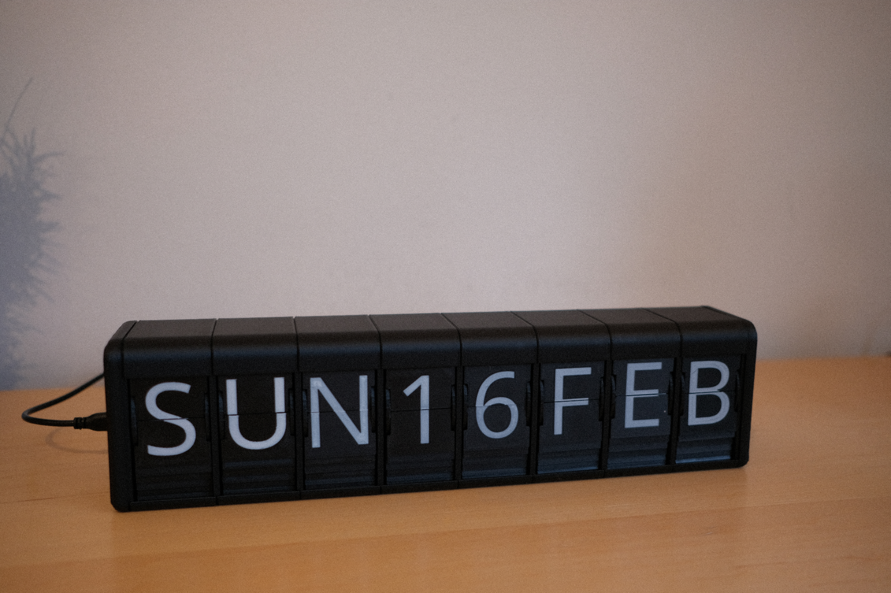
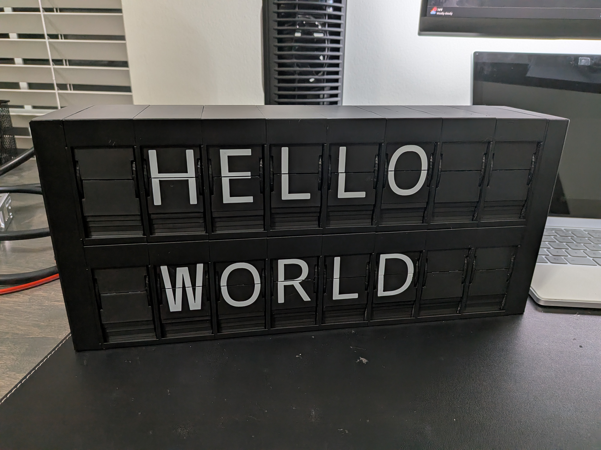

# Build & Assembly

There are two build options for this project:

<figure style="flex: 1; text-align: center; margin: 0;" markdown>

</figure>
<figure style="flex: 1; text-align: center; margin: 0;" markdown>

</figure>

- **Original Display**

    ---

    Single ESP32 controlling up to :material-numeric-8-box: modules over a single I²C bus. 
    
    The original design by Morgan Manly. This project was further improved upon by the community (notably Jordan Hoff, Thom Koopman, and various discord members) with refining the code, increasing the flap count to 48, creating custom pcbs, and much more.

    [:octicons-arrow-right-24: Original build guide](original/index.md)

- **Dual Display**

    ---

    Single ESP32 controlling up to :material-numeric-1-box::material-numeric-6-box: modules over two I²C buses. 
    
    Enhanced version by Drew Ferguson, based on the original design.

    [:octicons-arrow-right-24: Dual display guide](dual-display/index.md)

## Which build is right for you?

| | Original | Dual |
|---|---|---|
| Max modules | 8 | 16 |
| Display rows | 1 | 2 |
| Characters shown | 8 | 16 |
| I²C buses | 1 | 2 |
| Dual-bus firmware[^1] | ✅ | ✅ |
| Original (rounded) enclosure | ✅ | ❌ |
| Square enclosure | ✅[^2] | ✅ |
| Supports 37 flaps | ✅ | ✅ |
| Supports 48 flaps | ✅ | ❌ |
| Enhanced flap accuracy[^3] | ✅ | ✅ |
| DIY PCB option | ✅ | ✅ |
| Purchased PCB option | ✅ | ✅ |
| Supported ESP32 boards[^4] | ESP32, ESP32-C3, ESP32-S3 | ESP32 |

[^1]: _Code is backwards compatible for non-dual setups_

[^2]: _Square enclosure (currently) only supports 37. Original (rounded) enclosure supports both counts._

[^3]: _Only comes with the square enclosure._

[^4]: _Dual display currently requires the ESP32 (`esp32_n4`) — it's the only board built with two hardware I²C buses enabled. The S3 has the same two-I²C-controller capability but that build isn't planned for the S3 SuperMini/Zero (found less reliable and slower than the ESP32 in testing) — the upcoming 44-pin S3 board is a different, more capable design and will get it instead. The C3 has only one I²C controller, so it can't do dual regardless. See [Supported Hardware](../firmware/hardware.md) for chip details and specific boards._
