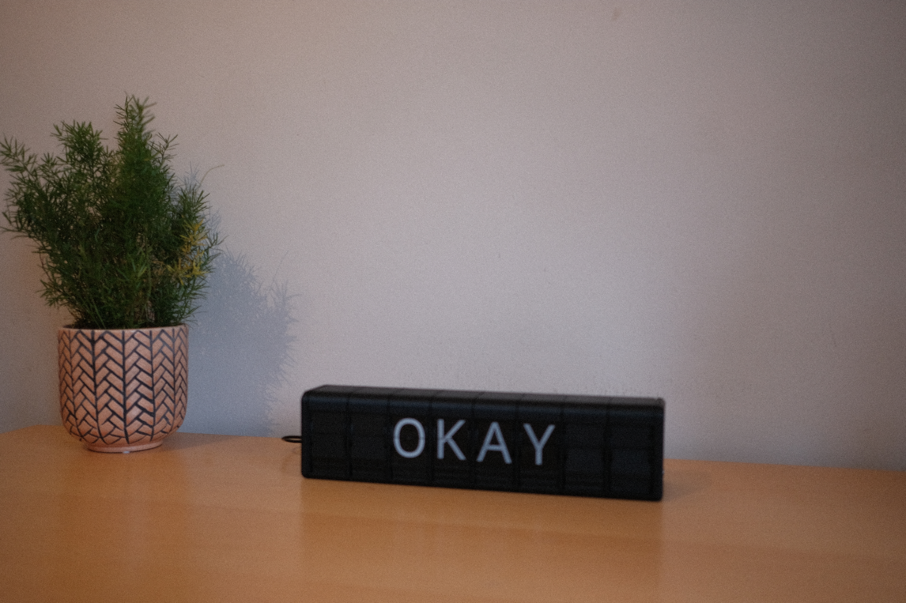
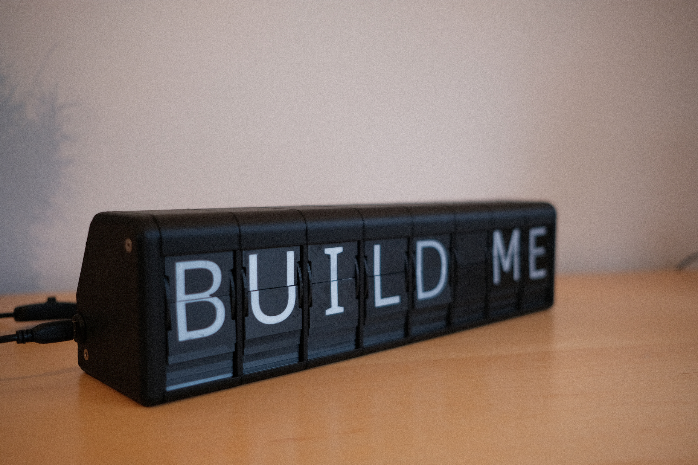
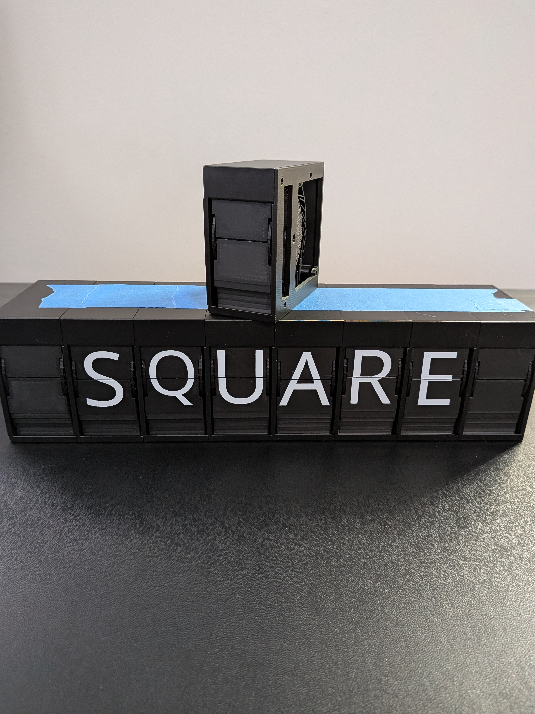
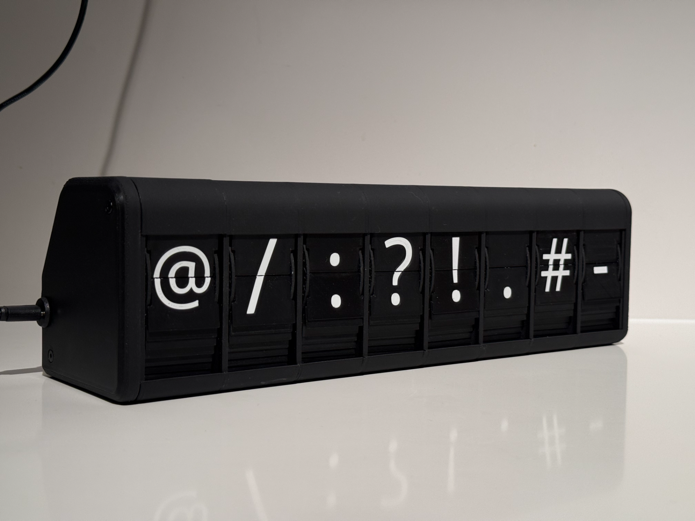

# Original Display — 37 / 48 Characters

<figure markdown>

</figure>

The original design supports up to **8 modules** on a single I²C bus. Full build instructions were written by [Morgan Manly](https://github.com/ManlyMorgan/Split-Flap-Display) and are hosted on Instructables.

## Build instructions

:fontawesome-solid-arrow-up-right-from-square: **[Full build guide on Instructables](https://www.instructables.com/Split-Flap-Display-3D-Printed-Modular-Compact-Encl/)**

The Instructables guide covers the complete build: 3D printing, hardware assembly, wiring, and firmware upload. It is the authoritative reference for the original design.

## Print files

| Version | Characters | Preview | Print files |
|---|---|---|---|
| Original | 37 | { width="160" } | [MakerWorld](https://makerworld.com/en/models/1116618#profileId-1114192) |
| Square | 37 | { width="160" } | [MakerWorld](https://makerworld.com/en/models/2489058-split-flap-display-square-enclosure#profileId-2734898) |
| Extended | 48 | { width="160" } | [MakerWorld](https://makerworld.com/en/models/1296793-split-flap-display-extended-charset-48-flaps#profileId-1328346) |

The **48-character extended version** is recommended — it includes lowercase letters and additional symbols.

## Firmware

Both versions use the same firmware in this repository. Follow the [firmware setup guide](../../firmware/setup.md) to build and flash.
