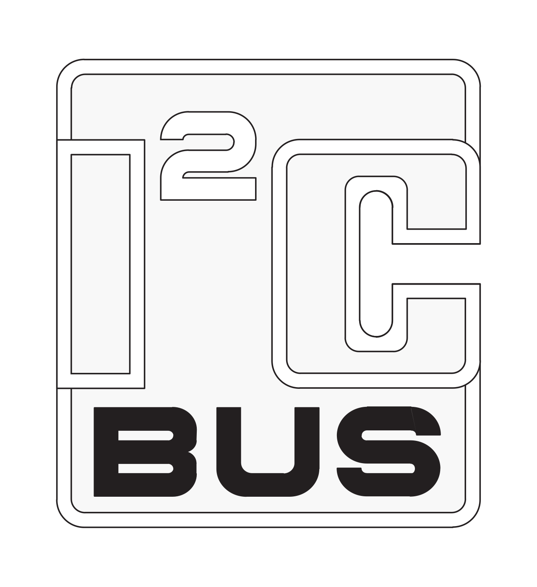
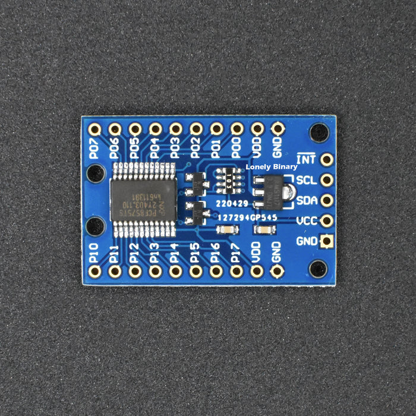
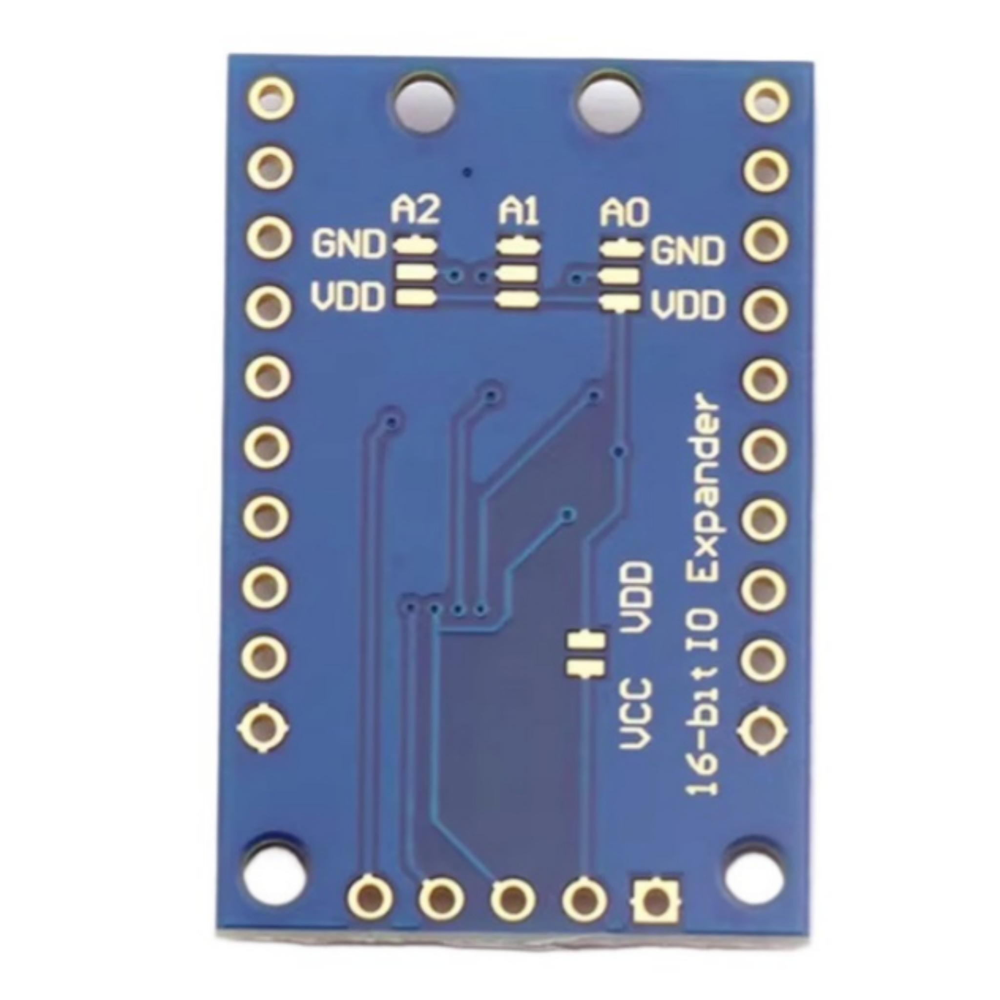
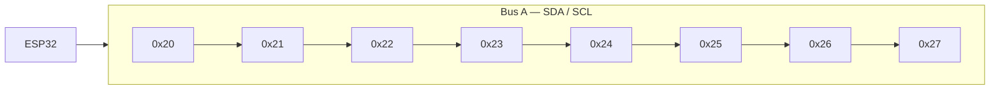
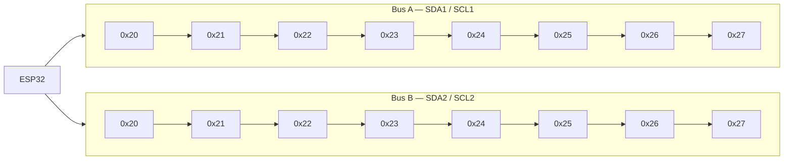
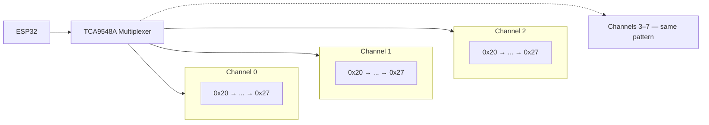
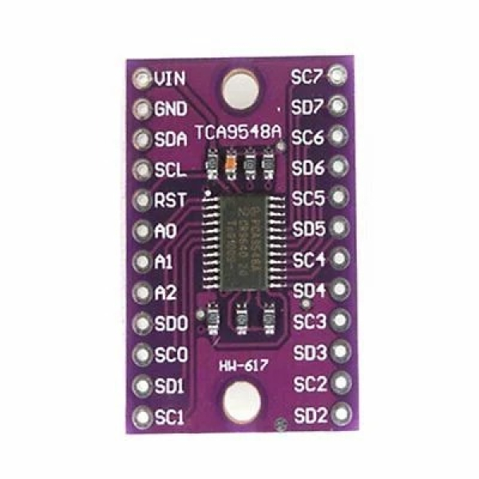

# I²C Reference

{ width="220" .center }

I²C (Inter-Integrated Circuit) is the communication protocol used to control every split-flap module in this project. Understanding how it works explains many of the design decisions — including why a second bus is needed for 16 modules.

## How I²C works

I²C is a two-wire serial bus:

| Wire | Name | Purpose |
|---|---|---|
| **SDA** | Serial Data | Carries data between devices |
| **SCL** | Serial Clock | Synchronizes communication (driven by the controller) |

All devices on a bus share these two wires. The ESP32 acts as the **controller** (master), and each split-flap PCB is a **target** (peripheral). The controller initiates all communication — targets only respond when addressed.

### Addressing

Every device on an I²C bus must have a unique **7-bit address** (0–127). The controller uses this address to direct messages to a specific device. If two devices share an address, communication breaks down — neither responds correctly.

### Pull-up resistors

SDA and SCL must be pulled up to VCC through resistors (typically 4.7kΩ). Without pull-ups the bus will not function. Only one set of pull-ups is needed per bus — not one per board.

---

## How it's used in this project

Each module's controller or PCB contains a **PCF8575** — a 16-bit I²C I/O expander that drives the stepper motor coils via a ULN2003 motor driver. The ESP32 sends I²C commands to each PCF8575 to step the motor and home the drum.

{ width="280" }

*PCF8575 I/O expander — one per module, addressed via the onboard DIP switch*

### Address assignment via DIP switch

The PCF8575 has three address pins — **A0, A1, A2** — that set its I²C address. Each board has a 6-position DIP switch to configure these pins. The 8 possible combinations (000–111 in binary) give **8 unique addresses per bus**:

| DIP (A2·A1·A0) | I²C Address |
|---|---|
| 000 | 0x20 |
| 001 | 0x21 |
| 010 | 0x22 |
| 011 | 0x23 |
| 100 | 0x24 |
| 101 | 0x25 |
| 110 | 0x26 |
| 111 | 0x27 |

Every module in a chain must have a different DIP switch setting. Modules sharing an address will conflict.

{ width="280" }

*Back of the PCF8575 board — solder the A0, A1, A2 pads to either GND (logic 0) or VDD (logic 1) to set the address. Each unique combination maps to one address in the table above.*

---

## Limitations

### 8 modules per bus

The PCF8575 supports only 8 unique addresses (0x20–0x27). This hard-caps the number of modules at **8 per I²C bus**, regardless of bus speed or cable length.

### 16-module ceiling

The ESP32 has two hardware I²C peripherals — **Bus A** and **Bus B** — each running independently. By using both buses with a full set of 8 modules each, the maximum is **16 modules total**. This is the design limit of the dual display configuration.

### Cable length and bus capacitance

I²C is designed for short on-board runs. Long cables add capacitance that slows signal edges and can cause communication errors. The daisy-chain headers between modules keep runs short, but very long total chain lengths (many modules spread over a large display) may require lower bus speeds or active signal buffering.

### No hot-plugging

I²C devices should not be connected or disconnected while the bus is powered. Always power down before reconfiguring module connections.

---

## Scaling beyond 16 modules

Going past the 16-module dual-bus ceiling is possible but runs into a second, much harder limit: **I²C bus throughput**. This section captures what the community has tried and what actually works.

### I²C multiplexers (TCA9548A) — addressing only, not throughput

A multiplexer like the **TCA9548A** sits between the ESP32 and the modules, splitting one I²C bus into up to 8 isolated channels. Each channel can hold a full 8 modules at addresses `0x20–0x27`, so on paper one multiplexer gives `8 × 8 = 64` addressable modules per bus, or 512+ across two buses with two multiplexers.

**It works for addressing.** Drew tested a TCA9548A successfully driving 30 modules across multiple channels:

> *"I got i2c multiplexing working with the code (which in theory allows 512+ addressable modules), and I was able to successfully test this with 30 modules. Big win just to get this point!"* — drewferg11

**But it doesn't fix throughput.** When all 30 modules tried to update simultaneously, the bus couldn't keep up:

> *"when I tried to update all 30 modules at the same time, they turned very slowly… the i2c bus can't send all the required commands to every module on a single bus at the same time at a fast enough speed. The more modules you add, the slower it gets. I tried threading the commands, batching them, only updating modules that need to be changed, messing with bus speeds, etc, but nothing got me to full performance speed."* — drewferg11

The practical ceiling for **full-speed simultaneous updates on a single I²C bus is roughly 13 modules**. Beyond that the motors visibly slow down — they still step correctly, just at a fraction of normal speed. Idle current cost of the multiplexer itself is negligible (~30mA), so the bottleneck is purely bus bandwidth.

{ width="280" }

*TCA9548A multiplexer — splits one I²C bus into 8 isolated channels*

!!! info "Multiplexer overhead"
    *"At idle, adding the single multiplexer required an extra 0.03 amps."* — drewferg11. The TCA9548A is not what's slowing things down.

### Multi-ESP32 — the way to scale further

For displays significantly larger than 16 modules, the community's working approach is **multiple ESP32s, each driving its own slice of the display**, synchronized at a higher layer (e.g. MQTT or a coordinator ESP):

> *"I've switched back to a multi-esp setup. So a single esp will drive a max of 20 modules using 2 i2c buses and a multiplexer per bus (this allows max performance), and for a total of 5 esps. Then I'll have to modify the code (todo) to make them all sync up and act as one combined display."* — drewferg11 (planning a 100-module display)

The 20-modules-per-ESP figure assumes you want full-speed simultaneous updates. If you can tolerate slower updates or stagger them, a single ESP can drive more.

### Alternative architectures (for reference)

Other split-flap projects sidestep I²C entirely. The [Scott Bezek Splitflap Chainlink Driver](https://github.com/scottbez1/splitflap) uses a TPL7407L driver with shared parallel lines, driving 100+ modules from a single bus by sending step commands to all motors simultaneously. It scales further than I²C but requires a different PCB and firmware approach — a trade-off this project hasn't taken because I²C addressing is much simpler.

> *"Instead of an i2c bus with addressing, this appears to use a single bus to drive all of the motors simultaneously. I suspect that is how they're able to run over 100 at once, which is something we'll struggle with using i2c."* — jhoff0804

---

## Common failures & lessons learned

These are the I²C-shaped problems community members have actually hit when building displays. Many turn out to **not be I²C bugs** at all — power and pull-ups account for most of them.

### "It worked with one module, breaks when I add a second"

Almost always missing or insufficient **pull-up resistors**. The bus can sometimes appear to function with one device because the device's internal weak pull-up on the PCF8575 is barely enough — adding a second target loads the bus down past the threshold.

> *"When just one module is connected, the module works fine and homes without any problem. When I connect the second module (address 33), the first module (address 32) doesn't home correctly… When I detach the second module, the first one is working correctly again."* — n1co_93 (resolved by adding the 4.7kΩ pull-ups)

**Fix:** Confirm 4.7kΩ pull-ups are installed on SDA and SCL on one board in the chain. See the [custom PCB page](module-boards/custom-pcb/dowjames-v5.1/index.md#1-add-ic-pull-up-resistors) for placement guidance.

### "Adding the 3rd / 7th / 8th module makes the display freeze"

Often **power**, not I²C. As the daisy chain grows, voltage sag at the far end of the chain can drop motor voltage below the threshold needed to step reliably. The symptoms look like I²C failure (modules go unresponsive, display freezes) but bus traffic is fine.

> *"Adding the third PCB consistently results in the display to stop working. Not seeing any i2c errors though so I'm back to checking the power lines."* — community member, page 1

**Fix:** Use a beefier 5V supply, run thicker power wires, or feed power to the middle of the chain instead of one end so voltage drop is symmetric.

### "I²C error codes appear under load but vanish on a different power supply"

A noisy or undersized PSU can inject enough disturbance to corrupt I²C edges. norpan reported clearing intermittent I²C error codes (2 and 5) by switching to a higher-quality dedicated supply for the modules. If your bus is glitchy under motor load but clean when idle, suspect the power supply before suspecting the bus.

### "Two modules at the same address" (you forgot the DIP switch)

If a fresh module is unresponsive in a chain, the most common cause is the DIP switch defaulting to `0x20` and conflicting with another module. Two devices at the same address corrupt every transaction — neither will work correctly.

**Fix:** Each module gets a unique DIP setting from the address table above. Document your assignments somewhere so you don't lose track.

### Long cable runs cause intermittent errors

The total bus capacitance from cumulative cable length eventually slows signal edges enough to cause errors at standard clock speeds. The fix is either shorter cables, lower clock speed, or active bus buffering — but for typical 8–16 module builds with daisy-chain headers, this rarely matters.
