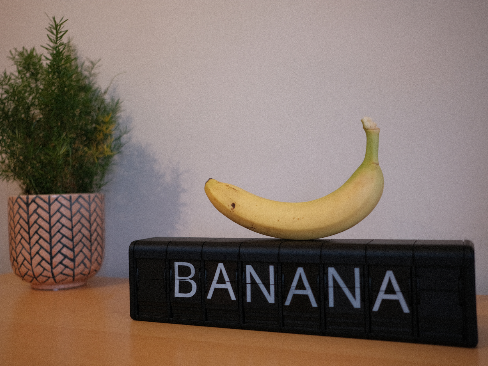

# Split Flap Display

A fully 3D-printed, modular split-flap display with an ESP32-based web interface. This project builds on the original hardware design by [Morgan Manly](https://github.com/ManlyMorgan/Split-Flap-Display) with extended firmware, an improved custom PCB, and support for a **16-module dual I²C configuration**.

<figure markdown>
  
</figure>

- :material-printer-3d: **Build & Assembly**

    ---

    Step-by-step guides for the original single display or the 16-module dual display setup.

    [:octicons-arrow-right-24: Start building](build/index.md)

- :material-code-tags: **Firmware**

    ---

    Build, flash, and configure the ESP32-based firmware.

    [:octicons-arrow-right-24: Firmware docs](firmware/index.md)

- :fontawesome-brands-discord: **Community**

    ---

    Help, build threads, and shared lessons.

    [:octicons-arrow-right-24: Join the Discord](https://discord.gg/RCvks4XXXH)

- :fontawesome-brands-github: **Source**

    ---

    Firmware, PCB files, and print files on GitHub.

    [:octicons-arrow-right-24: View repository](https://github.com/DrewFerg11/Split-Flap-Display)

- :fontawesome-solid-heart: **Support**

    ---

    If this project saved you time or inspired your build, consider supporting further development.

    [:simple-kofi: Ko-fi](https://ko-fi.com/drewferg11) · [:fontawesome-brands-github: GitHub Sponsors](https://github.com/sponsors/DrewFerg11)

---

## Credits

The dual display configuration, 3D-printed enclosure designs, controller board design, system wiring, firmware enhancements, and this documentation were developed by [DrewFerg11](https://github.com/DrewFerg11). Built on the original split-flap design by [Morgan Manly](https://github.com/ManlyMorgan/Split-Flap-Display), with community contributions from Jordan Hoff, Thom Koopman, and many others in the [Discord](https://discord.gg/RCvks4XXXH).
