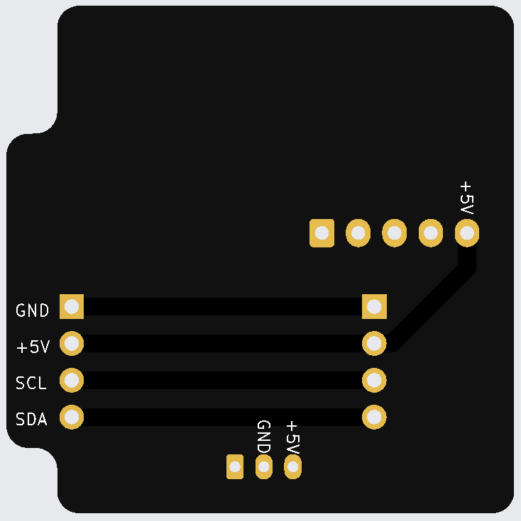

# dowjames v5.1

The dowjames v5.1 is the first community-designed split-flap module PCB. It integrates the PCF8575 I/O expander, ULN2003 motor driver, hall sensor connector, and I²C daisy-chain headers onto a single compact board — ordered fully assembled from JLCPCB.

<figure style="flex: 1; text-align: center;" markdown>

<figcaption>Front</figcaption>
</figure>
<figure style="flex: 1; text-align: center;" markdown>

<figcaption>Back</figcaption>
</figure>

[Order from JLCPCB](ordering.md){ .md-button .md-button--primary }

---

## Specs

| | |
|---|---|
| **I²C expander** | PCF8575 |
| **Motor driver** | ULN2003 |
| **Address config** | 3-pin DIP switch (A0/A1/A2) — 8 unique addresses |
| **Daisy-chain** | 4-pin NEXT/PREV right-angle headers (+5V, GND, SCL, SDA) |
| **Assembly** | Top-side SMT, assembled by JLCPCB |
| **Minimum order** | 10 boards |

## What arrives assembled

All SMT components are pre-soldered by JLCPCB:

- PCF8575 I²C I/O expander
- ULN2003 motor driver
- Bypass capacitors
- DIP switch
- Hall sensor connector
- NEXT/PREV daisy-chain headers

## What you still need to do

### 1. Add I²C Pull-Up Resistors

You **must** add **4.7kΩ pull-up resistors** on the I²C SDA and SCL lines or the display will not work. Add them on the **first board in each chain only**.

See the [I²C reference](../../../i2c.md#pull-up-resistors) for placement details.

### 2. Set DIP Switch Addresses

Each board needs a unique I²C address set via the onboard 3-pin DIP switch. See the [I²C reference](../../../i2c.md#address-assignment-via-dip-switch) for the address table. Every module in a chain must have a different setting.

### 3. Connect Power

Use a **5V supply rated for at least 5A** per 8-module chain. The Raspberry Pi 5 official power supply (5.1V, 5A USB-C) is widely recommended by the community.

**Power the boards directly from the 5V supply** — don't run power through the ESP32's USB port for a full display. The USB traces on small ESP32 variants aren't rated for motor current.

---

!!! warning "Flash firmware before connecting motors"
    The PCF8575 pulls all output pins HIGH by default. With a motor connected and no firmware running, both motor coils are energized continuously — the motor gets hot enough to warp flaps and burn fingers. **Have your firmware ready before connecting motors.**
