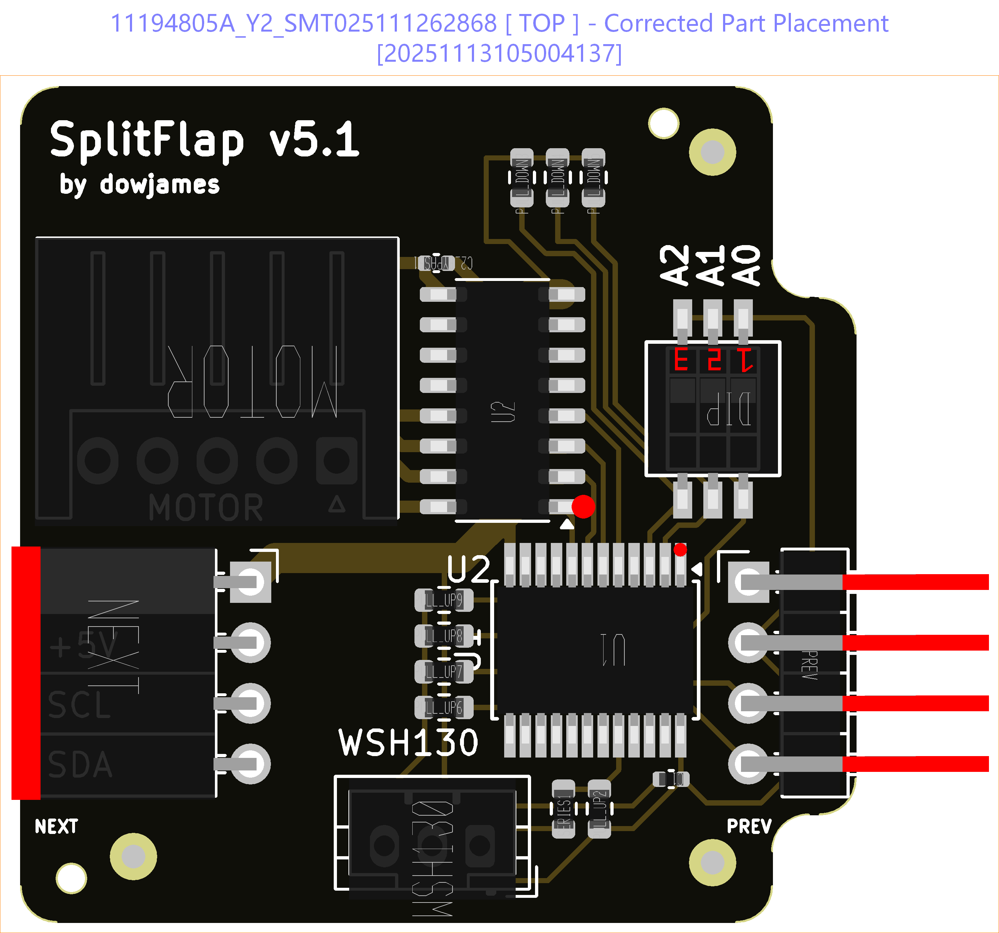
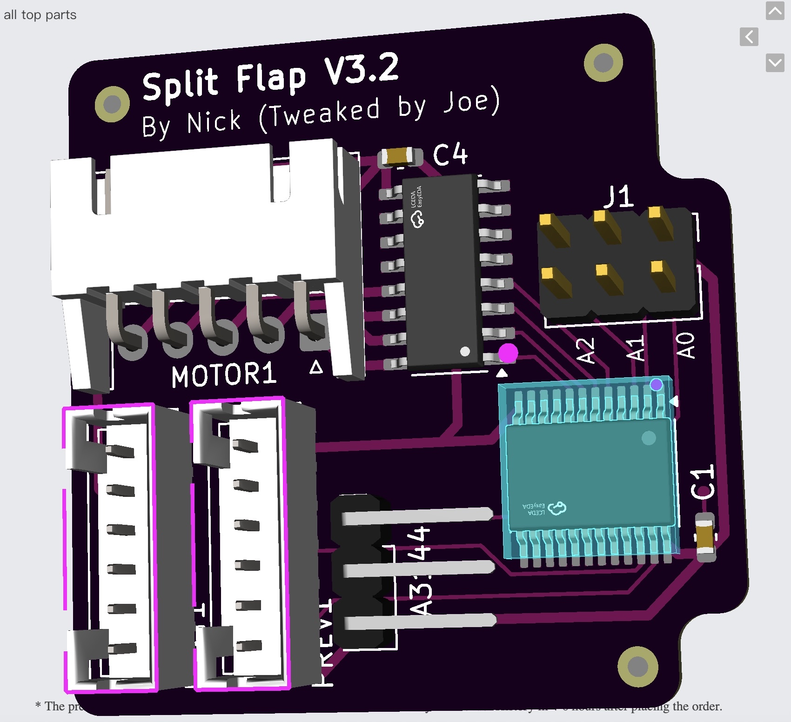

# Ordering from JLCPCB

Step-by-step instructions for ordering the dowjames v5.1 from [JLCPCB](https://jlcpcb.com/) with full SMT assembly.

## Files

Download **`splitflapv5.1-pcb.zip`** from the [`custom-pcb/dowjames-v5.1/`](https://github.com/DrewFerg11/Split-Flap-Display/tree/main/custom-pcb/dowjames-v5.1) folder of the repository and unzip it. Inside you'll find a `splitflapv5.1-pcb/` folder with three files:

| File | Purpose |
|---|---|
| `gerber.zip` | Gerber + drill files — upload as the PCB manufacturing file |
| `bom.csv` | Bill of materials with LCSC part numbers |
| `positions.csv` | Pick-and-place / CPL file for component positioning |

---

## Step 1: Upload Gerbers

!!! tip "Log in before uploading"
    Upload while logged in to your JLCPCB account. If you upload the gerber while logged out, the site may not auto-populate the PCB dimensions and you'll be left with blank X/Y fields.

1. Unzip `splitflapv5.1-pcb.zip` — the three files are inside the `splitflapv5.1-pcb/` folder
2. Go to [https://cart.jlcpcb.com/quote](https://cart.jlcpcb.com/quote)
3. Click **"Add gerber file"** and upload `gerber.zip`
4. JLCPCB will parse the files and show a PCB preview

## Step 2: Configure PCB Options

| Setting | Value |
|---|---|
| **Quantity** | 10 (minimum for assembly — a good number for a display) |
| **PCB Color** | Your choice (black and green are popular) |
| **PCB Thickness** | **1.6mm** — don't change this |
| **Surface Finish** | Default (HASL) is fine |

Leave everything else at defaults.

## Step 3: Enable PCB Assembly

1. Scroll down and toggle **"PCB Assembly"** to ON
2. Select **"Assemble top side"**
3. Set assembly quantity to match your PCB quantity
4. Click **"Confirm"** or **"Next"**

## Step 4: Upload BOM and Positions Files

1. Click **"Upload BOM/CPL"**
2. Upload `bom.csv` as the BOM file
3. Upload `positions.csv` as the CPL file
4. Click **"Process BOM & CPL"**

## Step 5: Review Matched Parts

You should see **12 parts detected, 12 parts confirmed**:

!!! warning "Only 3 parts matched?"
    If you see only 3 matched parts and many unmatched components, you uploaded the wrong files. Make sure you're using `bom.csv` and `positions.csv` from inside the `splitflapv5.1-pcb/` folder within the zip — not any other folder.

    

**Make sure all parts are selected.** The two bypass capacitors — `C1` and `C2_BYPASS1` — may show quantity 0 and be unselected by default. **Select them.** Despite the `BYPASS` name they're capacitors, not resistors.

## Step 6: Review Component Placement

On the placement review page JLCPCB shows a 3D render of component positions. Some components may appear rotated — this is a known issue with their visualizer.

- Compare each component to the PCB silkscreen
- Rotate any components that appear sideways using the **Rotate** button
- The WSH130 hall sensor connector may need rotation
- **The DIP switch will look "upside-down" — this is intentional.** dowjames mounted it this way so the `1, 2, 3` labels read correctly when installed. Don't try to fix it.

> *"I think they get confused because I mounted the dip switches upside down.. but because they're labelled 1,2,3 it would look stupid if they were mounted the other way round"* — dowjames

## Step 7: Review Pricing and Checkout

1. Review the order summary
2. **Change the shipping method** — JLCPCB defaults to the fastest (most expensive) option. Pick something more economical if you're not in a rush.
3. **Check the [JLCPCB coupons page](https://jlcpcb.com/coupons)** before placing your order.

*Price reference as of Nov 2025 — 10 assembled PCBs shipped to Germany*

---

## Confirmation Emails from JLCPCB

JLCPCB may email you within a few hours with questions about component placement. This is normal for SMT orders.

### "Are the polarities and placements correct?"

**Reply: Yes, the placement and polarities are correct.**

### "Do you want the header pins at a right angle?"

**Reply: Yes, that is correct.** The right-angle headers are how the boards daisy-chain together.

---

## Quick Reference

| Item | Value |
|---|---|
| **Gerber file** | `gerber.zip` |
| **BOM file** | `bom.csv` |
| **CPL file** | `positions.csv` |
| **PCB quantity** | 10 (minimum for assembly) |
| **PCB thickness** | 1.6mm |
| **Assembly side** | Top |
| **Polarity email** | Reply "Yes, correct" |
| **Header pin email** | Reply "Yes, right angle is correct" |
