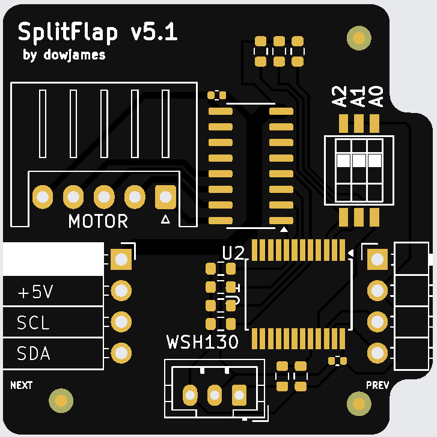

# Custom PCBs

Custom PCBs are purpose-built boards designed by community members and ordered assembled from JLCPCB. All SMT components arrive pre-soldered — assembly is minimal compared to the DIY board.

Each board listed here is a drop-in per-module driver, meaning one board per split-flap module.

---

## Available Boards

- **dowjames v5.1**

    ---

    { width="180" align=right }

    The first community-designed PCB. Compact, fully assembled by JLCPCB, and battle-tested across many community builds.

    [:octicons-arrow-right-24: Board details](dowjames-v5.1/index.md)

---

## Common gotchas

These apply to all PCF8575-based custom PCBs, regardless of board version.

### Flash firmware before connecting motors

The PCF8575 I/O expander pulls all output pins HIGH by default on power-up. With a motor connected and no firmware running, both stepper coils are energized continuously — the motor and ULN2003 driver get hot enough to warp flaps and burn fingers.

**Have your firmware flashed and running before connecting motors.** At minimum, disconnect the motor connector until the ESP32 is running real code.

> *"I was reminded of this when I took my module apart and about burnt my fingers. I measured the plastic housing at about 130°F"* — jhoff0804

### Pull-up resistors are required

The I²C bus will not function without **4.7kΩ pull-up resistors** on SDA and SCL. You only need them on **one board per chain** — typically the first module closest to the ESP32. Each individual board does not need its own set.

See the [I²C reference](../../i2c.md#pull-up-resistors) for placement details.

### Power the boards directly — not through the ESP32 USB

Don't power a full module chain through the ESP32's USB port. The USB traces on small ESP32 variants (C3, S3) aren't rated for motor current and the wires will get hot. Connect 5V power directly to the first board's power terminals and let it daisy-chain from there.
